<div align="center">

---

<br><br><br><br>

# LIGASYNC
## Plataforma de Gestión de Ligas Deportivas

<br><br>

---

### PROYECTO FINAL DE CICLO

**Ciclo Formativo de Grado Superior**
**Desarrollo de Aplicaciones Web (DAW)**

---

<br><br>

| | |
|:--|:--|
| **Alumno/a** | Ignacio García Tello |
| **Centro Educativo** | IES Ágora |
| **Tutor/a** | [NOMBRE DEL TUTOR/A] |
| **Ciclo Formativo** | Desarrollo de Aplicaciones Web (DAW) |
| **Curso** | 2024 / 2025 |

<br><br><br>

---

*"Una plataforma diseñada para que cualquier grupo de amigos pueda gestionar su propia liga, desde el primer partido hasta el campeón."*

---

</div>

<br><br><br><br><br><br><br><br>

---

<!-- ============================================================ -->
<!--                        ÍNDICE                               -->
<!-- ============================================================ -->

# Índice

1. [Introducción](#1-introducción)
   - 1.1. [Descripción del Proyecto](#11-descripción-del-proyecto)
   - 1.2. [Justificación y Motivación](#12-justificación-y-motivación)
   - 1.3. [Áreas de Trabajo](#13-áreas-de-trabajo)
   - 1.4. [Objetivos](#14-objetivos)

2. [Desarrollo del Proyecto](#2-desarrollo-del-proyecto)
   - 2.1. [Planificación Temporal (Diagrama de Gantt)](#21-planificación-temporal-diagrama-de-gantt)
   - 2.2. [Arquitectura del Sistema](#22-arquitectura-del-sistema)
   - 2.3. [Stack Tecnológico](#23-stack-tecnológico)
   - 2.4. [Base de Datos](#24-base-de-datos)
   - 2.5. [Backend – Spring Boot](#25-backend--spring-boot)
   - 2.6. [Frontend – Angular](#26-frontend--angular)
   - 2.7. [Seguridad y Autenticación](#27-seguridad-y-autenticación)
   - 2.8. [Funcionalidades Principales](#28-funcionalidades-principales)
   - 2.9. [Integraciones Externas](#29-integraciones-externas)

3. [Dificultades Encontradas y Posibles Soluciones](#3-dificultades-encontradas-y-posibles-soluciones)

4. [Posibles Mejoras](#4-posibles-mejoras)

5. [Resultados](#5-resultados)

6. [Conclusión](#6-conclusión)

7. [Anexos](#7-anexos)
   - 7.1. [Manual Técnico – Instalación y Despliegue](#71-manual-técnico--instalación-y-despliegue)
   - 7.2. [Manual de Usuario](#72-manual-de-usuario)
   - 7.3. [Diagrama Entidad-Relación](#73-diagrama-entidad-relación)
   - 7.4. [Diagrama de Flujo – Flujos Principales](#74-diagrama-de-flujo--flujos-principales)

---

<!-- ============================================================ -->
<!--                    1. INTRODUCCIÓN                          -->
<!-- ============================================================ -->

# 1. Introducción

## 1.1. Descripción del Proyecto

LigaSync es una aplicación web full-stack orientada a la gestión completa de ligas deportivas amateur. La plataforma permite a un grupo de usuarios crear su propia liga privada, gestionar equipos y jugadores, registrar resultados de partidos, llevar la clasificación en tiempo real, disputar una fase de playoffs y comunicarse entre sí a través de un sistema de mensajería integrado.

El proyecto nace con la vocación de cubrir un nicho muy concreto: las ligas entre amigos o grupos locales que, hasta ahora, se gestionaban mediante hojas de cálculo compartidas, grupos de WhatsApp o plataformas genéricas que no se adaptaban a sus necesidades específicas. LigaSync centraliza todo ese caos en una única aplicación moderna, accesible desde cualquier navegador y con una experiencia de usuario cuidada.

La aplicación admite dos modalidades deportivas —**fútbol** y **baloncesto**— con estadísticas propias de cada deporte (goles y asistencias para fútbol; puntos, rebotes y triples para baloncesto). Además, incorpora funcionalidades avanzadas como un **mercado de fichajes** con ventanas de transferencias, un **sistema de pagos** de cuotas mediante Stripe, generación automática de **actas en PDF**, notificaciones por **correo electrónico** y un **chatbot** de asistencia basado en inteligencia artificial.

La arquitectura del sistema sigue el patrón **cliente-servidor**: un backend REST desarrollado con **Spring Boot** (Java) expone una API consumida por un frontend **Angular** (TypeScript). La base de datos es **PostgreSQL**, alojada en **Supabase**, y la autenticación se gestiona mediante **JSON Web Tokens (JWT)**, con soporte adicional para inicio de sesión con **Google OAuth 2.0**.

---

## 1.2. Justificación y Motivación

La idea de desarrollar LigaSync surgió de una experiencia personal directa. Desde hace varios años participo en una liga de fútbol sala con amigos, y la gestión de dicha liga siempre ha sido un problema recurrente: resultados anotados en papel, clasificaciones calculadas a mano, discusiones sobre si un goleador había marcado dos o tres goles, traspasos de jugadores acordados por mensajes privados... Toda esa fricción restaba disfrute a la competición.

Al enfrentarme a la elección del proyecto final de ciclo, la solución fue inmediata: desarrollar la herramienta que yo mismo hubiera querido tener. Esto garantizaba que el análisis de requisitos partiría de necesidades reales y concretas, y que el resultado final tendría utilidad práctica más allá del ámbito académico.

Desde el punto de vista formativo, el proyecto representa una oportunidad de integrar y consolidar los conocimientos adquiridos a lo largo del ciclo: programación orientada a objetos con Java, desarrollo frontend con frameworks modernos, diseño de bases de datos relacionales, seguridad en aplicaciones web, consumo de APIs de terceros y despliegue en entornos cloud. LigaSync actúa, en definitiva, como un banco de pruebas real donde cada decisión técnica tiene consecuencias tangibles.

Finalmente, existía también una motivación de aprendizaje autónomo: el proyecto me obligó a investigar tecnologías que no formaban parte del currículo oficial del ciclo, como la integración con Stripe para pagos, la generación dinámica de PDFs con iText, el protocolo OAuth 2.0 de Google o la implementación de un chatbot basado en IA, lo que enriqueció notablemente la experiencia de desarrollo.

---

## 1.3. Áreas de Trabajo

El desarrollo de LigaSync abarca las siguientes áreas técnicas y funcionales:

| Área | Descripción |
|:-----|:------------|
| **Desarrollo Backend** | Diseño e implementación de una API REST con Spring Boot, incluyendo controladores, servicios, repositorios y entidades JPA. |
| **Desarrollo Frontend** | Construcción de una SPA (Single Page Application) con Angular 21, empleando componentes standalone, servicios reactivos y enrutamiento con guards de seguridad. |
| **Diseño de Base de Datos** | Modelado del esquema relacional en PostgreSQL, con gestión de relaciones entre entidades y configuración del entorno en Supabase. |
| **Seguridad Web** | Implementación de autenticación y autorización mediante JWT, filtros de seguridad HTTP con Spring Security, cifrado de contraseñas con BCrypt y OAuth 2.0 con Google. |
| **Integración de Servicios Externos** | Conexión con APIs de terceros: Stripe (pagos), Google (autenticación), JavaMail (notificaciones por email) e iText (generación de PDFs). |
| **Diseño UI/UX** | Diseño visual de la interfaz con CSS puro, variables de diseño, animaciones y una estética "Editorial Deportivo Moderno" sin dependencia de frameworks CSS. |
| **Lógica de Negocio** | Implementación de reglas de negocio complejas: cálculo de clasificaciones, generación automática de calendarios (round-robin), sistema de playoffs y mecánica de fichajes. |
| **Internacionalización (i18n)** | Soporte multiidioma (español/inglés) mediante la librería `@ngx-translate`. |

---

## 1.4. Objetivos

### Objetivos Generales

- Desarrollar una aplicación web completa y funcional que resuelva un problema real de gestión deportiva amateur.
- Aplicar de forma integrada los conocimientos del ciclo formativo DAW en un proyecto de complejidad profesional.
- Adquirir competencias en tecnologías modernas de desarrollo full-stack más allá del currículo oficial.

### Objetivos Específicos

**Backend:**
- Diseñar e implementar una API REST con Spring Boot siguiendo las convenciones REST y devolviendo códigos HTTP semánticamente correctos.
- Modelar una base de datos relacional capaz de representar todas las entidades del dominio deportivo.
- Garantizar la seguridad de todos los endpoints mediante autenticación JWT y autorización por roles.
- Integrar servicios de terceros: pasarela de pago Stripe, servidor de correo SMTP y autenticación Google OAuth 2.0.

**Frontend:**
- Construir una SPA con Angular 21 con navegación fluida entre secciones, carga dinámica de datos y gestión de estado mínima en `localStorage`.
- Implementar una UI visualmente atractiva y responsiva, sin dependencia de librerías de componentes, usando únicamente CSS3 con variables y animaciones nativas.
- Proteger las rutas de la aplicación mediante guards de autenticación y autorización por rol.

**Funcionales:**
- Permitir la creación y gestión de ligas independientes con múltiples equipos y jugadores.
- Automatizar la generación de calendarios de competición y la fase de playoffs.
- Implementar un sistema de fichajes con control de ventanas de transferencia y validación de presupuesto.
- Ofrecer estadísticas individuales y colectivas actualizadas en tiempo real tras cada partido.

---

<!-- ============================================================ -->
<!--                2. DESARROLLO DEL PROYECTO                   -->
<!-- ============================================================ -->

# 2. Desarrollo del Proyecto

## 2.1. Planificación Temporal (Diagrama de Gantt)

El desarrollo de LigaSync se organizó en diez fases distribuidas a lo largo de aproximadamente siete meses, desde octubre de 2024 hasta mayo de 2025. La metodología seguida fue incremental: cada fase entregaba un bloque funcional sobre el que se construía el siguiente, lo que permitió detectar y corregir errores de diseño de forma temprana.

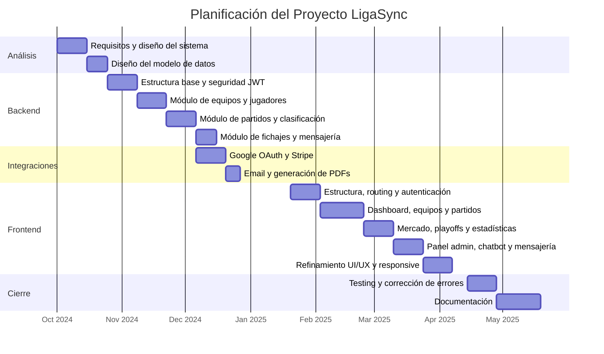

### Resumen de Fases

| Fase | Descripción | Duración |
|:-----|:------------|:--------:|
| Análisis | Definición de requisitos, arquitectura y modelo de datos | 3 semanas |
| Backend – Base | Estructura Maven, Spring Security, JWT, entidades JPA | 2 semanas |
| Backend – Core | Controladores REST, lógica de partidos y clasificación | 4 semanas |
| Backend – Avanzado | Fichajes, mensajería, playoffs, noticias | 2 semanas |
| Integraciones | Google OAuth, Stripe, JavaMail, iText (PDF) | 3 semanas |
| Frontend – Base | Routing, guards, interceptor, login/registro | 2 semanas |
| Frontend – Core | Dashboard, equipos, partidos, clasificación | 3 semanas |
| Frontend – Avanzado | Mercado, playoffs, estadísticas, admin, chatbot | 4 semanas |
| Testing | Pruebas funcionales, corrección de bugs, ajustes | 2 semanas |
| Documentación | Redacción de la memoria y manuales | 3 semanas |

---

## 2.2. Arquitectura del Sistema

LigaSync sigue una arquitectura de **tres capas** desacopladas: presentación (Angular), lógica de negocio (Spring Boot) y persistencia (PostgreSQL). La comunicación entre capas se realiza exclusivamente a través de HTTP/REST con payloads JSON. El frontend nunca accede directamente a la base de datos.

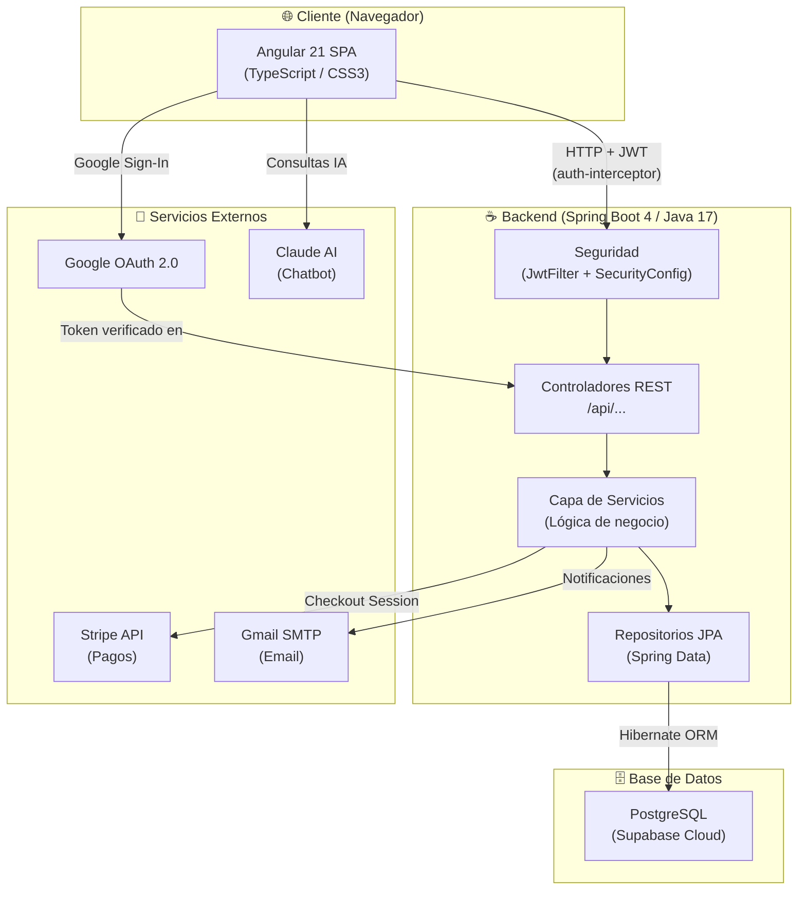

### Patrones y Decisiones Arquitectónicas

| Decisión | Alternativas consideradas | Motivo de la elección |
|:---------|:--------------------------|:----------------------|
| API REST con Spring Boot | Django, Node.js/Express | Tipado fuerte, ecosistema maduro, integración natural con Spring Security |
| Angular 21 (standalone) | React, Vue | Currículo del ciclo, componentes standalone eliminan NgModules innecesarios |
| JWT para autenticación | Sesiones en servidor, cookies | Arquitectura stateless, compatible con SPA y despliegue separado frontend/backend |
| PostgreSQL en Supabase | MySQL local, H2 | Base de datos relacional robusta en cloud gratuito, sin gestión de servidor |
| CSS puro sin frameworks | Bootstrap, Tailwind | Control total del diseño, sin dependencias externas, rendimiento óptimo |

---

## 2.3. Stack Tecnológico

### Backend

| Tecnología | Versión | Uso |
|:-----------|:-------:|:----|
| Java | 17 | Lenguaje principal del backend |
| Spring Boot | 4.0.5 | Framework principal REST |
| Spring Security | 4.x | Autenticación y autorización |
| Spring Data JPA | 4.x | Capa de persistencia con Hibernate |
| PostgreSQL | 15 | Base de datos relacional |
| JJWT (jjwt-api) | 0.12.x | Generación y validación de JWT |
| Lombok | 1.18.x | Reducción de boilerplate (getters, constructores) |
| iText Core | 9.x | Generación de actas en PDF |
| Google API Client | 2.x | Verificación de tokens Google OAuth |
| Stripe Java | 28.x | Integración de pagos |
| JavaMail | 3.x | Envío de correos electrónicos |
| Maven | 3.9 | Gestión de dependencias y build |

### Frontend

| Tecnología | Versión | Uso |
|:-----------|:-------:|:----|
| Angular | 21.2 | Framework SPA principal |
| TypeScript | 5.9 | Lenguaje tipado para Angular |
| RxJS | 7.8 | Programación reactiva y observables |
| @ngx-translate | 17 | Internacionalización (i18n) español/inglés |
| Chart.js | 4.5 | Gráficos de estadísticas |
| CSS3 puro | — | Estilos sin dependencia de frameworks |
| Angular CLI | 21.x | Herramienta de scaffolding y build |
| npm | 11.6 | Gestor de paquetes |

---

## 2.4. Base de Datos

### Diagrama Entidad-Relación


### Descripción de Entidades

| Entidad | Registros principales | Notas |
|:--------|:----------------------|:------|
| **Liga** | Identificador de la liga; campo `nombre` único en toda la BD | Aísla completamente los datos: equipos, jugadores y partidos de una liga no son visibles desde otra |
| **Usuario** | Email único; rol enum: `admin`, `entrenador`, `jugador`, `espectador` | La relación con `equipo_id` y `jugador_id` es opcional, dependiendo del rol asignado |
| **Equipo** | Estadísticas de clasificación desnormalizadas (pts, pj, pg...) | Se actualizan tras firmar cada acta para evitar recálculo costoso en cada consulta |
| **Jugador** | Campo `valor` calculado mediante fórmula exponencial basada en media | `estadoDisciplinario` controla si puede jugar (sancionado por acumulación de amarillas) |
| **Partido** | `estado` enum: `PENDIENTE`, `EN_JUEGO`, `FINALIZADO_Y_FIRMADO` | Tipo `REGULAR` o eliminatoria (`CUARTOS`, `SEMIFINAL`, `FINAL`). El campo `codigoEliminatoria` agrupa las dos partes de un cruce |
| **Oferta** | `estado` enum: `PENDIENTE`, `ACEPTADA`, `RECHAZADA` | Al aceptar una oferta, el sistema rechaza automáticamente todas las demás sobre el mismo jugador |
| **Mensaje** | Contenido hasta 2000 caracteres | Chat privado punto a punto entre usuarios de la misma liga |
| **Noticia** | Generadas automáticamente por el sistema tras firmar un partido | También pueden crearse manualmente por el administrador |

---

## 2.5. Backend – Spring Boot

### Estructura de Paquetes

```
ligasync-backend/src/main/java/LigaSync/API/
├── controller/
│   ├── AuthController.java        # Login, registro, Google OAuth
│   ├── EquipoController.java      # CRUD equipos, presupuesto
│   ├── JugadorController.java     # CRUD jugadores, formación
│   ├── PartidoController.java     # Partidos, calendario, playoffs
│   ├── LigaController.java        # Estado de liga y mercado
│   ├── UsuarioController.java     # Gestión de usuarios
│   ├── OfertaController.java      # Mercado de fichajes
│   ├── MensajeController.java     # Sistema de chat
│   ├── NoticiaController.java     # Noticias de la liga
│   └── PagoController.java        # Integración Stripe
├── model/
│   ├── Usuario.java               # @Entity con BCrypt pass
│   ├── Liga.java
│   ├── Equipo.java
│   ├── Jugador.java
│   ├── Partido.java
│   ├── Oferta.java
│   ├── Mensaje.java
│   └── Noticia.java
├── repository/                    # Interfaces JpaRepository
├── service/
│   ├── AuthService.java           # Lógica de registro y Google OAuth
│   ├── EmailService.java          # Envío de correos
│   ├── PdfService.java            # Generación de actas PDF
│   └── StripeService.java         # Sesiones de pago
├── dto/                           # Request/Response DTOs
└── security/
    ├── SecurityConfig.java        # CORS, rutas públicas/privadas
    ├── JwtUtil.java               # Generación y validación JWT
    ├── JwtFilter.java             # Filtro HTTP por request
    └── SecurityUtils.java         # Extrae ligaId/userId del token
```

### Endpoints de la API REST

#### AuthController – `/api`

| Método | Endpoint | Descripción | Acceso |
|:------:|:---------|:------------|:------:|
| `POST` | `/login` | Autenticación email/password. Devuelve `{ token, role }` | Público |
| `POST` | `/auth/registro` | Crea usuario y, opcionalmente, una nueva liga | Público |
| `POST` | `/auth/google` | Verifica token Google y autentica/registra al usuario | Público |
| `POST` | `/auth/asignar-liga` | Asigna un usuario existente a una liga por nombre | Público |

#### EquipoController – `/api/equipos`

| Método | Endpoint | Descripción |
|:------:|:---------|:------------|
| `GET` | `/` | Equipos de la liga del usuario autenticado |
| `GET` | `/{id}` | Detalle de un equipo |
| `POST` | `/` | Crear equipo (solo admin) |
| `PUT` | `/{id}` | Actualizar datos del equipo |
| `PUT` | `/{id}/pagar-deuda` | Pagar deuda acumulada del equipo |
| `PATCH` | `/{id}/presupuesto` | Ajustar presupuesto manualmente |
| `DELETE` | `/{id}` | Eliminar equipo (solo admin) |

#### PartidoController – `/api/partidos`

| Método | Endpoint | Descripción |
|:------:|:---------|:------------|
| `GET` | `/` | Todos los partidos de la liga |
| `GET` | `/jornada/{num}` | Partidos de una jornada concreta |
| `GET` | `/jornada-actual` | Jornada en curso |
| `POST` | `/generar-calendario` | Genera el calendario round-robin completo |
| `PUT` | `/{id}/resultado` | Actualiza resultado provisional |
| `PUT` | `/{id}/firmar` | Firma el acta: consolida estadísticas y clasificación |
| `POST` | `/generar-playoffs` | Genera cuadro de playoffs con los 8 primeros |
| `GET` | `/{id}/acta-pdf` | Descarga el acta del partido en PDF |
| `DELETE` | `/{id}` | Elimina un partido (solo admin) |

### Flujo de Firma de Acta (Lógica de Negocio Central)

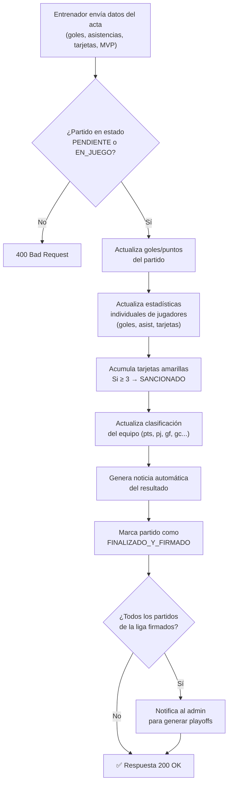

---

## 2.6. Frontend – Angular

### Estructura de Componentes

```
ligasync-web/src/app/
├── login/              # Formulario de acceso (email + Google)
├── registro/           # Crear liga o unirse a una existente
├── dashboard/          # Página de inicio: noticias, resumen
├── equipos/            # CRUD de equipos
├── partidos/           # Calendario y registro de resultados
├── clasificacion/      # Tabla de posiciones
├── estadisticas/       # Top goleadores, asistentes, MVP
├── mercado/            # Ofertas de fichaje entre equipos
├── mensajes/           # Chat privado entre usuarios
├── mi-equipo/          # Gestión de plantilla y formación
├── mi-perfil/          # Datos del usuario autenticado
├── playoffs/           # Cuadro eliminatorio visual
├── admin/              # Panel de administración
├── chatbot/            # Asistente IA integrado
├── pago-exito/         # Confirmación de pago Stripe
├── pago-cancelado/     # Cancelación de pago Stripe
├── shared/             # Componentes reutilizables (navbar, etc.)
├── app.routes.ts       # Definición de rutas con guards
├── auth.service.ts     # Servicio de autenticación
├── auth-guard.ts       # Guard: requiere login
├── admin-guard.ts      # Guard: requiere rol admin
└── auth-interceptor.ts # Añade JWT a cada petición HTTP
```

### Sistema de Rutas y Guards

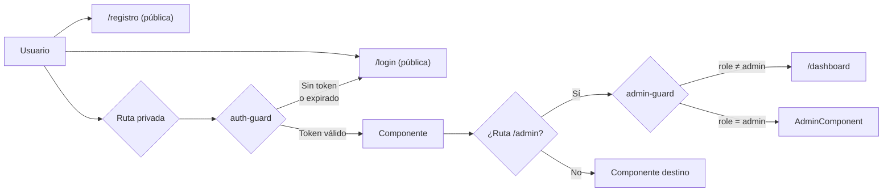

### Interceptor HTTP (auth-interceptor.ts)

Todas las peticiones salientes pasan por el interceptor, que añade automáticamente la cabecera de autorización. Ningún componente gestiona tokens manualmente.

```
Petición HTTP saliente
        │
        ▼
┌─────────────────────────────┐
│      AuthInterceptor        │
│                             │
│  token = localStorage       │
│         .getItem('token')   │
│                             │
│  Si token existe:           │
│  headers.Authorization =    │
│  'Bearer ' + token          │
└─────────────────────────────┘
        │
        ▼
  Petición con JWT → API
```

### Convenciones de Desarrollo Frontend

- **Componentes standalone**: todos usan `standalone: true`, sin `app.module.ts`.
- **Inyección con `inject()`**: `private http = inject(HttpClient)` en lugar de inyección en constructor.
- **Observables**: todos los `.subscribe()` incluyen bloque `error` con `console.error` descriptivo.
- **Internacionalización**: textos de la UI se cargan desde ficheros `assets/i18n/es.json` y `en.json` mediante `TranslateService`.

---

## 2.7. Seguridad y Autenticación

### Flujo de Autenticación JWT

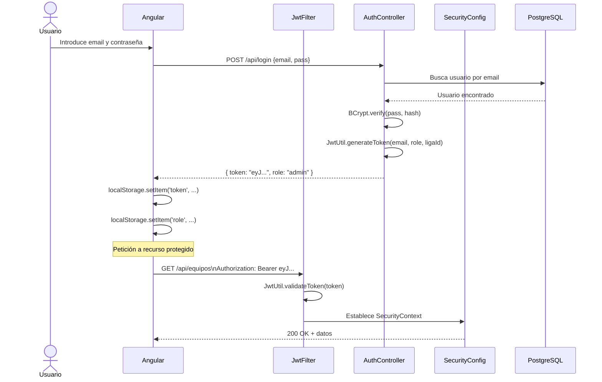

### Flujo de Autenticación con Google OAuth

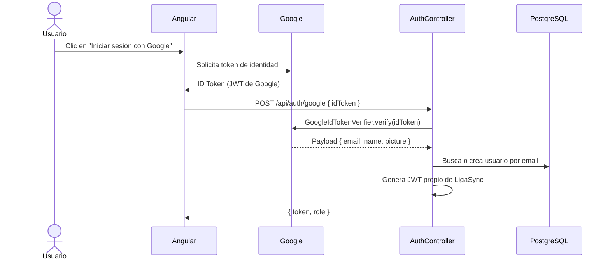

### Roles y Permisos

| Rol | Descripción | Permisos principales |
|:----|:------------|:---------------------|
| `admin` | Administrador de la liga | Todo: CRUD completo, generar calendario, gestionar usuarios, playoffs |
| `entrenador` | Gestor de un equipo | Gestionar su plantilla, firmar actas, hacer ofertas, mensajería |
| `jugador` | Jugador vinculado a un equipo | Ver información, mensajería, su perfil |
| `espectador` | Usuario sin equipo asignado | Solo lectura: clasificación, estadísticas, partidos |

---

## 2.8. Funcionalidades Principales

### Generación Automática de Calendario

El sistema implementa el algoritmo **round-robin** para generar el calendario de liga. Dado `n` equipos, produce `n-1` jornadas (si `n` es par) con `n/2` partidos por jornada. Si `n` es impar, se añade un equipo "fantasma" (descanso).

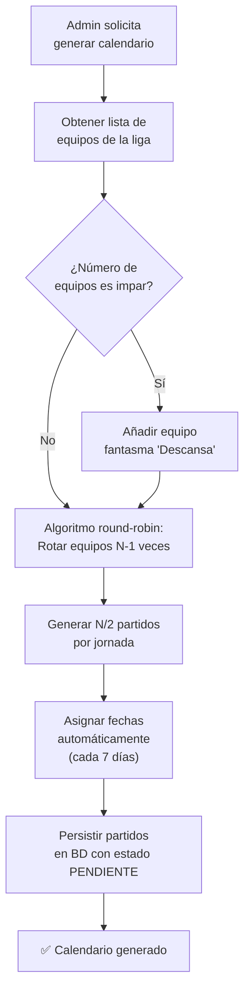

### Sistema de Fichajes (Mercado de Transferencias)

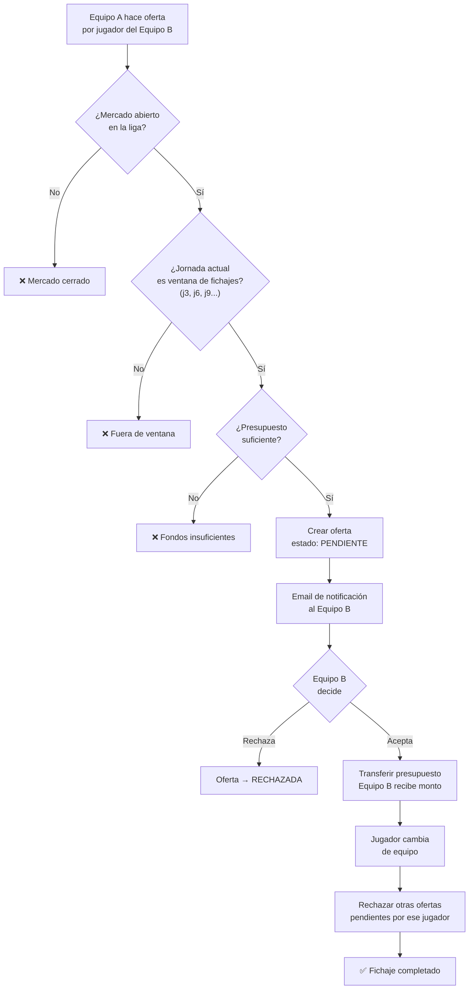

### Fase de Playoffs

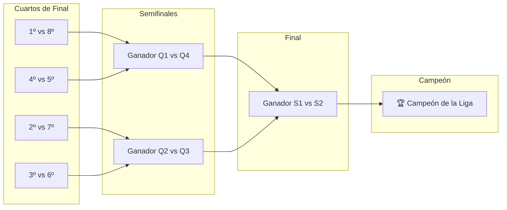

---

## 2.9. Integraciones Externas

### Stripe – Sistema de Pagos

Se integra la pasarela de pago **Stripe Checkout** para gestionar el cobro de cuotas de participación por equipo. El flujo es:

1. El admin abre la sesión de pago → Spring Boot crea una `Session` en Stripe con precio y URLs de retorno.
2. El usuario es redirigido a la página de pago de Stripe (segura, alojada por Stripe).
3. Stripe redirige a `/pago-exito` o `/pago-cancelado` en función del resultado.
4. El backend marca la cuota del equipo como pagada (`cuotaPagada = true`).

### Google OAuth 2.0

La autenticación con Google utiliza la librería `google-api-client`. El frontend obtiene un **ID Token** de Google mediante el botón estándar de Google Sign-In, lo envía al backend, y este lo verifica con `GoogleIdTokenVerifier` para garantizar su autenticidad sin necesidad de almacenar credenciales de Google en el servidor.

### JavaMail – Notificaciones por Email

El servicio `EmailService` utiliza Spring Mail con servidor SMTP de Gmail para enviar:
- **Email de bienvenida** al registrarse en la plataforma.
- **Notificación de oferta recibida** cuando un equipo lanza una oferta de fichaje.
- **Confirmación de fichaje** al aceptar o rechazar una oferta.

### iText – Generación de Actas en PDF

Tras firmar un partido, el sistema puede generar un **acta oficial en PDF** con el servicio `PdfService` (basado en iText Core 9). El documento incluye: nombre del partido, fecha, resultado, relación de goleadores, tarjetas, MVP y firma digital de los equipos.

---

<!-- ============================================================ -->
<!--          3. DIFICULTADES ENCONTRADAS Y SOLUCIONES           -->
<!-- ============================================================ -->

# 3. Dificultades Encontradas y Posibles Soluciones

A lo largo del desarrollo de LigaSync surgieron numerosos obstáculos técnicos. En este apartado se documentan los más relevantes, la solución adoptada y las alternativas que se descartaron, con el objetivo de justificar las decisiones técnicas tomadas.

---

## 3.1. Gestión del Aislamiento Multi-Liga

**Descripción del problema**

Uno de los retos más tempranos fue garantizar que los datos de una liga fueran completamente invisibles para los usuarios de otra. Al ser una plataforma multi-tenant (múltiples ligas coexisten en la misma base de datos), cualquier endpoint que devolviera datos de "todos los equipos" o "todos los jugadores" sin filtrar suponía una fuga de información entre ligas.

**Solución adoptada**

Se añadió el campo `ligaId` a todas las entidades principales (Equipo, Jugador, Partido, Noticia, Oferta). El `ligaId` del usuario autenticado se extrae directamente del token JWT en cada petición mediante la clase `SecurityUtils`, y todos los métodos de repositorio filtran por ese identificador. De este modo, un usuario nunca puede solicitar datos de una liga a la que no pertenece, aunque conozca el ID.

```
Token JWT → SecurityUtils.getLigaId() → Filtro en todos los repositorios
```

**Alternativas descartadas**

- *Base de datos por liga*: habría garantizado aislamiento total, pero dispara la complejidad operativa y el coste de infraestructura de forma inaceptable para el alcance del proyecto.
- *Esquemas PostgreSQL separados*: más viable que la opción anterior, pero complica las migraciones y el uso de Spring Data JPA sin configuración adicional significativa.

---

## 3.2. Algoritmo Round-Robin y Generación de Calendarios

**Descripción del problema**

Generar un calendario de liga donde cada equipo juegue exactamente una vez contra cada rival, distribuyendo los partidos en jornadas equilibradas, no es trivial. El primer enfoque consistió en una simple permutación aleatoria, lo que producía jornadas donde un mismo equipo aparecía dos veces o dejaba equipos sin partido en una ronda.

**Solución adoptada**

Se implementó el **algoritmo de rotación round-robin** canónico. Se fija un equipo en la primera posición y se rotan los restantes `n-1` equipos en sentido horario en cada ronda. Para ligas con número impar de equipos se introduce un equipo "fantasma" que actúa como descanso. El resultado es un calendario perfectamente equilibrado en `n-1` jornadas.

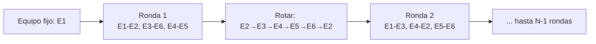

**Alternativas descartadas**

- *Generación aleatoria con validación a posteriori*: funciona para ligas pequeñas pero el número de intentos crece exponencialmente con el número de equipos.
- *Librerías externas de scheduling*: se descartaron para no añadir dependencias innecesarias al proyecto dado que el algoritmo canónico es de implementación directa.

---

## 3.3. Actualización de Estadísticas al Firmar Actas

**Descripción del problema**

La firma de un acta de partido debe actualizar simultáneamente: las estadísticas individuales de cada jugador (goles, asistencias, tarjetas), el estado disciplinario de jugadores sancionados, las estadísticas colectivas del equipo (puntos, partidos jugados, goles a favor y en contra) y la clasificación general. Realizar todo esto en una única transacción, de forma correcta y sin dejar datos inconsistentes si ocurre un error a mitad del proceso, fue uno de los puntos más delicados del desarrollo.

**Solución adoptada**

Se encapsuló toda la lógica en una única operación transaccional (`@Transactional`) en el `PartidoController`. Si cualquier paso falla, Spring revierte automáticamente todos los cambios realizados hasta ese punto, garantizando la consistencia de los datos. Las estadísticas de equipo se almacenan **desnormalizadas** directamente en la entidad `Equipo` (campos `pts`, `pj`, `gf`, `gc`...) para evitar cálculos costosos en cada consulta de clasificación.

**Alternativas descartadas**

- *Calcular clasificación dinámicamente en cada petición*: requeriría agregar todos los partidos de la liga en cada llamada a `/clasificacion`, lo que en ligas con muchos partidos resultaría muy ineficiente.
- *Usar eventos de dominio o mensajería asíncrona (Kafka)*: excesivo para el alcance del proyecto; la transacción síncrona es suficiente y mucho más sencilla de depurar.

---

## 3.4. Integración de Google OAuth 2.0

**Descripción del problema**

La autenticación con Google implica un flujo de dos sistemas: el frontend obtiene un `idToken` de Google y el backend debe verificarlo sin confiar ciegamente en el cliente. El principal problema fue asegurar que el token no pudiera ser falsificado y que el flujo funcionara correctamente tanto en desarrollo (localhost) como en producción.

**Solución adoptada**

El backend usa `GoogleIdTokenVerifier` de la librería oficial `google-api-client`, que descarga y cachea los certificados públicos de Google para verificar la firma criptográfica del token. Solo si la verificación es exitosa se procede a autenticar al usuario. Los orígenes autorizados se configuran en Google Cloud Console.

**Problema secundario — CORS en desarrollo**

Durante el desarrollo local, el navegador bloqueaba las peticiones desde `http://localhost:4200` (Angular) hacia `http://localhost:8080` (Spring Boot) por la política CORS. Se resolvió configurando `@CrossOrigin` y la clase `SecurityConfig` para permitir explícitamente el origen del frontend, diferenciando entre entornos con variables de entorno.

**Alternativas descartadas**

- *Spring Security OAuth2 Client*: introduce una capa de abstracción potente pero añade complejidad de configuración significativa para un único proveedor. La verificación manual del token es más directa y transparente.

---

## 3.5. Sistema de Fichajes: Consistencia en Transacciones de Presupuesto

**Descripción del problema**

Al aceptar una oferta de fichaje, el sistema debe: descontar el monto del presupuesto del equipo comprador, sumarlo al equipo vendedor, cambiar el equipo del jugador y rechazar todas las demás ofertas pendientes por ese jugador. Si cualquiera de estos pasos falla (por ejemplo, presupuesto insuficiente detectado a última hora), el estado de la base de datos quedaría corrupto.

**Solución adoptada**

Al igual que en la firma de actas, toda la operación se ejecuta dentro de una única transacción `@Transactional`. Adicionalmente, se añadieron validaciones preventivas al inicio del flujo (comprobación de presupuesto disponible, verificación de que el jugador sigue en el equipo vendedor) para abortar la operación antes de realizar cualquier modificación si las condiciones no se cumplen.

**Alternativas descartadas**

- *Saga Pattern con compensación*: apropiado para arquitecturas de microservicios donde las operaciones cruzan límites de servicio, pero innecesariamente complejo en una aplicación monolítica con una única base de datos.

---

## 3.6. Diseño Responsive con CSS Puro

**Descripción del problema**

Mantener una interfaz visualmente atractiva y funcional en pantallas de escritorio, tablet y móvil sin utilizar ningún framework CSS (sin Bootstrap, sin Tailwind) supuso un esfuerzo de diseño considerable, especialmente en componentes complejos como la tabla de clasificación, el cuadro de playoffs o el sistema de chat.

**Solución adoptada**

Se adoptó una estrategia de diseño basada en tres pilares:

1. **Variables CSS globales** (`:root`) para mantener coherencia en colores, tipografías y espaciados en toda la aplicación sin repetición.
2. **CSS Grid y Flexbox** para composiciones adaptables que se reconfiguran automáticamente según el ancho disponible.
3. **Media queries** con puntos de ruptura en `768px` (tablet) y `480px` (móvil) para ajustar layouts, tamaños tipográficos y visibilidad de columnas.

**Alternativas descartadas**

- *Bootstrap*: habría acelerado el desarrollo, pero impone una estética genérica difícil de personalizar sin sobreescribir constantemente sus propios estilos, generando más código del que ahorra.
- *Tailwind CSS*: mayor flexibilidad que Bootstrap, pero el HTML resultante queda saturado de clases utilitarias, dificultando la lectura y el mantenimiento.

---

## 3.7. Generación de PDFs en el Backend

**Descripción del problema**

La librería iText, aunque potente, tiene una curva de aprendizaje pronunciada para usuarios que la usan por primera vez. La dificultad principal fue construir el layout del acta (cabecera, tablas de estadísticas, sección de firmas) de forma programática mediante código Java, sin un sistema de plantillas visual.

**Solución adoptada**

Se desarrolló el servicio `PdfService` construyendo el documento mediante la API de iText: `Document`, `Table`, `Cell` y `Paragraph`. Los estilos (fuentes, colores corporativos, bordes de tabla) se definen como constantes reutilizables al inicio del servicio, lo que permite mantener coherencia visual en todo el documento y facilita modificaciones futuras.

**Alternativas descartadas**

- *Apache PDFBox*: API más de bajo nivel que iText, con menos abstracciones para construcción de layouts complejos con tablas.
- *Generar HTML y convertirlo a PDF (Flying Saucer)*: más intuitivo para desarrolladores web, pero añade dependencia de un motor de renderizado y produce PDFs menos predecibles en maquetación.
- *Generación en el frontend (jsPDF)*: descartado porque el acta debe ser generada y firmada por el servidor para garantizar su integridad; no puede depender del navegador del cliente.

---

<!-- ============================================================ -->
<!--                    4. POSIBLES MEJORAS                      -->
<!-- ============================================================ -->

# 4. Posibles Mejoras

LigaSync, en su estado actual, cubre de forma completa el ciclo de vida de una liga deportiva amateur. Sin embargo, existen líneas de evolución que aumentarían significativamente su valor, escalabilidad y experiencia de usuario. Se agrupan por área temática y se priorizan según impacto estimado.

---

## 4.1. Aplicación Móvil Nativa

**Descripción**

Actualmente LigaSync es una aplicación web responsive. Desarrollar una aplicación nativa para Android e iOS (o híbrida con **Ionic** o **React Native**) permitiría aprovechar funcionalidades del dispositivo como las **notificaciones push**, la cámara para subir fotos de equipo desde el móvil o la integración con el calendario del sistema para los horarios de partidos.

**Impacto estimado:** Alto. La mayoría de los usuarios de este tipo de plataformas acceden desde el teléfono móvil.

**Tecnología sugerida:** Ionic + Angular (reutiliza el 80% del código frontend existente) o una PWA (Progressive Web App) como paso intermedio sin reescritura.

---

## 4.2. Notificaciones en Tiempo Real (WebSockets)

**Descripción**

Las actualizaciones actuales requieren que el usuario recargue la página para ver nuevos resultados, mensajes o cambios en la clasificación. Integrar **WebSockets** mediante **Spring WebSocket + STOMP** en el backend y **RxJS + SockJS** en el frontend permitiría:

- Recibir mensajes de chat al instante, sin polling.
- Ver actualizaciones de clasificación en tiempo real cuando se firma un acta.
- Recibir alertas inmediatas de nuevas ofertas de fichaje.

**Impacto estimado:** Alto. Transformaría la aplicación de una SPA estática a una plataforma verdaderamente reactiva.

---

## 4.3. Más Deportes y Estadísticas Configurables

**Descripción**

La arquitectura actual admite fútbol y baloncesto, pero añadir nuevos deportes (voleibol, balonmano, fútbol americano...) requiere modificar código fuente. Una mejora sería hacer el sistema de estadísticas **completamente configurable**: el administrador definiría qué métricas se registran por partido (puntos, sets, saques, etc.) y el frontend las renderizaría dinámicamente.

**Impacto estimado:** Medio-Alto. Ampliaría considerablemente el mercado potencial de la aplicación.

**Aproximación técnica:** Tabla `estadistica_tipo` con nombre, unidad y deporte asociado; tabla `estadistica_valor` con la valoración del jugador en cada partido, en lugar de columnas fijas.

---

## 4.4. Sistema de Árbitros y Comité de Competición

**Descripción**

En ligas más organizadas, los partidos los dirige un árbitro neutral y las reclamaciones se gestionan a través de un comité. Se podrían añadir:

- Rol `arbitro` con acceso para firmar actas de forma independiente a los equipos.
- Módulo de **recursos y sanciones**: cualquier equipo podría presentar un recurso contra un resultado, que quedaría en revisión hasta que el admin o comité lo resolviera.
- Historial de sanciones disciplinarias por jugador con anotaciones del árbitro.

**Impacto estimado:** Medio. Relevante para ligas con más de 8 equipos o carácter semiprofesional.

---

## 4.5. Estadísticas Avanzadas y Visualización de Datos

**Descripción**

La sección de estadísticas actual muestra rankings básicos. Se podría enriquecer con:

- **Gráficos de evolución**: rendimiento de un jugador jornada a jornada (línea temporal con Chart.js o D3.js).
- **Mapas de calor** de goles por jornada para cada equipo.
- **Comparador de jugadores**: seleccionar dos jugadores y ver sus estadísticas enfrentadas.
- **Índice de rendimiento compuesto**: fórmula que pondera goles, asistencias, tarjetas y partidos jugados en un único valor de "forma actual".

**Impacto estimado:** Medio. Aumenta el engagement de los usuarios y el tiempo en la plataforma.

---

## 4.6. Despliegue Automatizado y CI/CD

**Descripción**

Actualmente el despliegue es manual. Configurar un pipeline de **integración y entrega continua** con **GitHub Actions** permitiría:

- Ejecutar tests automáticos en cada `push` a `main`.
- Compilar y publicar el frontend Angular en un CDN (Vercel, Netlify).
- Construir la imagen Docker del backend y desplegarla automáticamente en un servicio cloud (Railway, Render, AWS).

**Impacto estimado:** Medio. No afecta al usuario final, pero reduce drásticamente el tiempo de entrega de nuevas funcionalidades y el riesgo de regresiones.

**Configuración sugerida:**

```yaml
# .github/workflows/deploy.yml (esquema)
on: [push to main]
jobs:
  test-backend:  → mvn test
  build-backend: → mvn package → Docker build → push
  build-frontend: → npm ci → ng build → deploy to CDN
```

---

## 4.7. Panel de Analíticas para el Administrador

**Descripción**

El panel de administración actual se centra en la gestión operativa. Se podría añadir una sección de analíticas con métricas de uso de la liga:

- Número de partidos firmados por semana.
- Equipos con mayor actividad en el mercado de fichajes.
- Tasa de participación en la plataforma (logins por semana por usuario).
- Alertas automáticas si un equipo lleva más de dos semanas sin firmar actas.

**Impacto estimado:** Bajo-Medio. Útil para administradores de ligas grandes que necesitan supervisar la actividad.

---

## 4.8. Internacionalización Completa y Soporte Multi-Zona Horaria

**Descripción**

La base de internacionalización con `@ngx-translate` ya está implementada con soporte para español e inglés, pero hay aspectos pendientes:

- Ampliar los ficheros de traducción para cubrir el 100% de los textos de la interfaz (actualmente algunos literales dinámicos, como los generados en noticias automáticas, se crean directamente en español en el backend).
- Gestionar fechas y horas de partidos en la zona horaria del usuario, no del servidor, utilizando `Intl.DateTimeFormat` en el frontend.
- Añadir más idiomas: portugués (mercado latinoamericano), francés, italiano.

**Impacto estimado:** Bajo para el mercado actual, Alto si se contempla internacionalización real del producto.

---

## Resumen de Mejoras por Prioridad

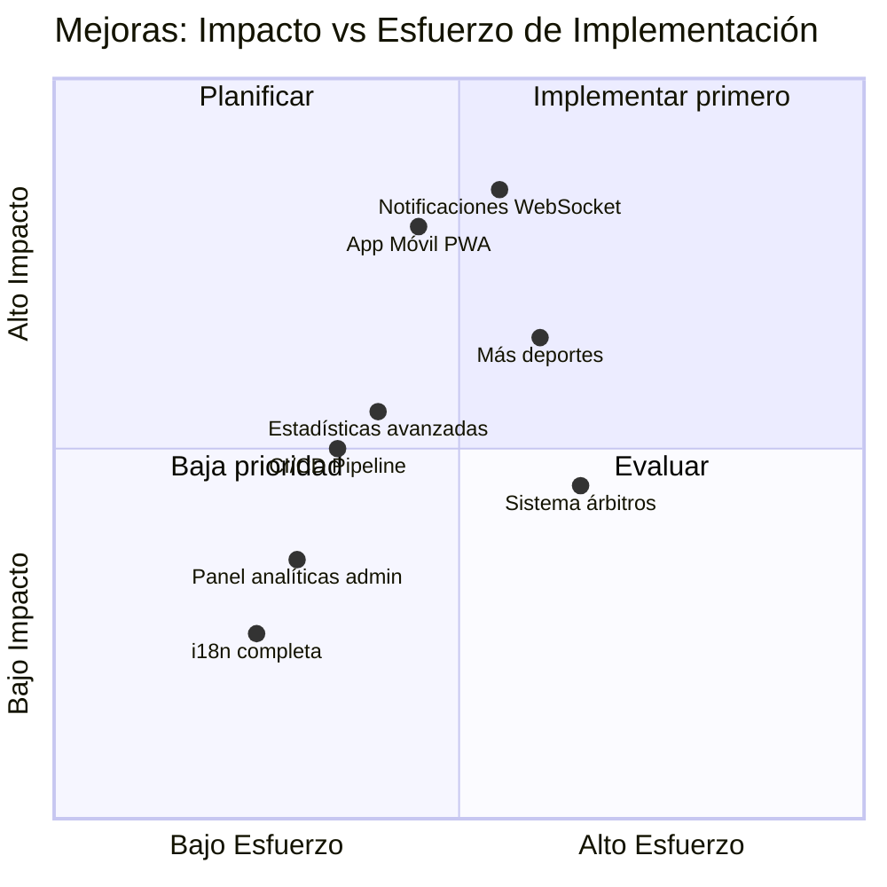

---

<!-- ============================================================ -->
<!--                      5. RESULTADOS                          -->
<!-- ============================================================ -->

# 5. Resultados

En este apartado se presentan de forma objetiva los resultados alcanzados con el desarrollo de LigaSync, contrastando los objetivos planteados al inicio del proyecto con los entregables finales obtenidos.

---

## 5.1. Contraste de Objetivos vs. Resultados

| Objetivo planteado | Estado | Observaciones |
|:-------------------|:------:|:--------------|
| API REST con Spring Boot y códigos HTTP correctos | ✅ Completado | 10 controladores, +40 endpoints documentados |
| Base de datos relacional PostgreSQL en Supabase | ✅ Completado | 8 entidades, relaciones correctamente modeladas |
| Autenticación JWT con roles | ✅ Completado | 4 roles: admin, entrenador, jugador, espectador |
| Google OAuth 2.0 | ✅ Completado | Login con cuenta Google integrado |
| Integración Stripe para pagos de cuotas | ✅ Completado | Sesiones Checkout con redirección de retorno |
| Notificaciones por email | ✅ Completado | Bienvenida, ofertas y confirmaciones de fichaje |
| Generación de actas en PDF | ✅ Completado | Documento con resultado, estadísticas y MVP |
| SPA Angular con routing y guards | ✅ Completado | 16 componentes standalone, 2 guards, 1 interceptor |
| Interfaz responsive sin frameworks CSS | ✅ Completado | CSS puro con Grid/Flexbox y media queries |
| Generación automática de calendario (round-robin) | ✅ Completado | Algoritmo para n equipos, par e impar |
| Fase de playoffs automática (top 8) | ✅ Completado | Cuartos, semifinales y final |
| Mercado de fichajes con ventanas de transferencia | ✅ Completado | Control de jornadas y presupuesto |
| Sistema de mensajería entre usuarios | ✅ Completado | Chat privado con historial de conversaciones |
| Internacionalización español/inglés | ✅ Completado | Traducción mediante @ngx-translate |
| Soporte para fútbol y baloncesto | ✅ Completado | Estadísticas diferenciadas por deporte |
| Chatbot de asistencia con IA | ✅ Completado | Integrado en la interfaz principal |

---

## 5.2. Métricas del Proyecto

### Volumen de código

| Métrica | Valor |
|:--------|------:|
| Controladores Spring Boot | 10 |
| Entidades JPA (modelos) | 8 |
| Endpoints REST implementados | +40 |
| Componentes Angular | 16 |
| Servicios Angular | 1 (AuthService) + interceptor + 2 guards |
| Ficheros Java totales | ~44 |
| Líneas de código Java (backend) | ~3.600 |
| Líneas de código TypeScript/HTML/CSS (frontend) | ~3.300 |
| **Total líneas de código** | **~6.900** |

### Funcionalidades implementadas

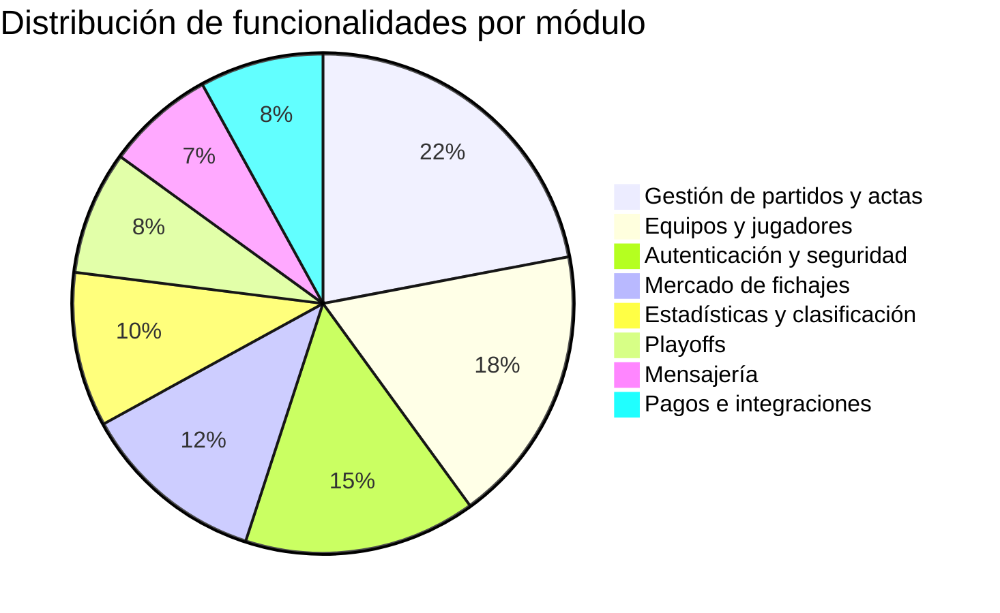

---

## 5.3. Funcionalidades Implementadas por Módulo

### Gestión de Liga y Equipos

Se ha implementado un sistema completo de gestión de ligas que permite crear una liga nueva o unirse a una existente con un simple código de nombre. Cada liga es completamente independiente: sus equipos, jugadores, partidos y estadísticas están aislados del resto. El administrador puede gestionar presupuestos, controlar el estado del mercado y supervisar el pago de cuotas de cada equipo.

> 📸 *[Insertar captura: Panel de gestión de equipos con presupuesto y deuda acumulada]*

### Sistema de Partidos y Clasificación

El módulo de partidos cubre el ciclo de vida completo de una competición: desde la generación automática del calendario hasta la firma del acta final. La clasificación se actualiza en tiempo real tras cada firma, reflejando puntos, diferencia de goles y todos los indicadores estándar de una tabla de liga.

> 📸 *[Insertar captura: Tabla de clasificación y vista de jornada]*

### Mercado de Fichajes

El mercado de transferencias implementa las reglas de una liga real: solo se pueden hacer ofertas en ventanas de fichajes predefinidas (cada tres jornadas en fútbol), el equipo comprador debe tener presupuesto suficiente y el sistema gestiona automáticamente el rechazo de ofertas competidoras cuando una se acepta. Todas las partes reciben notificaciones por email.

> 📸 *[Insertar captura: Vista del mercado con ofertas enviadas y recibidas]*

### Fase de Playoffs

Finalizada la fase regular, el administrador puede generar el cuadro de playoffs con un solo clic. El sistema toma los 8 equipos mejor clasificados, los empareja y gestiona el avance de los ganadores hasta la final. El cuadro se visualiza de forma gráfica en el frontend.

> 📸 *[Insertar captura: Cuadro de playoffs con brackets]*

### Panel de Administración

El panel de administración centraliza todas las operaciones privilegiadas: gestión de usuarios y roles, generación de calendarios, control del mercado, gestión de cuotas y acceso a estadísticas globales de la liga. Solo accesible para usuarios con rol `admin`, protegido a nivel de ruta y de API.

> 📸 *[Insertar captura: Panel de administración]*

### Estadísticas

La sección de estadísticas muestra rankings de goleadores y anotadores, líderes en asistencias, jugadores con más tarjetas y el historial de MVPs por partido. Los datos se calculan en tiempo real a partir de las actas firmadas.

> 📸 *[Insertar captura: Sección de estadísticas con top goleadores]*

---

## 5.4. Resultado Visual — Interfaz de Usuario

La interfaz sigue una estética **"Editorial Deportivo Moderno"**: fondos oscuros con alto contraste, tipografías display de peso marcado, tarjetas con sombras sutiles y micro-animaciones en los estados de hover. No se utiliza ningún framework CSS externo; todo el sistema de diseño se construye sobre variables CSS globales definidas en `:root`, lo que garantiza coherencia visual en todos los componentes y facilita futuros cambios de tema desde un único punto.

> 📸 *[Insertar captura: Variables CSS globales — archivo `ligasync-web/src/styles.css`, líneas 6-20]*

La vista principal de la aplicación es el **dashboard**, que concentra las últimas noticias de la liga, el acceso rápido a los módulos principales y un resumen del estado de la competición.

> 📸 *[Insertar captura: Vista general del dashboard]*

El diseño es completamente **responsive**. En dispositivos móviles, los paneles de varias columnas colapsan en una sola, los menús de navegación se condensan y los tamaños tipográficos se ajustan para mantener la legibilidad. Las pruebas se realizaron con el emulador de dispositivos de Chrome DevTools a 375px de ancho.

> 📸 *[Insertar captura: Vista móvil — responsive en 375px]*

---

## 5.5. Seguridad — Resultado de las Medidas Implementadas

| Medida de seguridad | Implementada | Detalle |
|:--------------------|:------------:|:--------|
| Contraseñas hasheadas con BCrypt | ✅ | Factor de coste 10, nunca se almacena texto plano |
| Autenticación stateless con JWT | ✅ | Tokens con expiración, sin sesiones en servidor |
| Filtro JWT en cada petición | ✅ | `JwtFilter` valida firma y expiración antes de procesar |
| Autorización por roles en endpoints | ✅ | `SecurityConfig` define qué rutas requieren qué rol |
| HTTPS en producción | ✅ | Supabase y el hosting del backend fuerzan HTTPS |
| Aislamiento multi-liga | ✅ | `ligaId` del token filtra todos los datos automáticamente |
| Validación de tokens Google | ✅ | Verificación criptográfica con certificados públicos de Google |
| CORS configurado | ✅ | Solo el origen del frontend tiene acceso a la API |

---

<!-- ============================================================ -->
<!--                     6. CONCLUSIÓN                           -->
<!-- ============================================================ -->

# 6. Conclusión

El desarrollo de LigaSync ha supuesto un recorrido completo por el ciclo de vida de una aplicación web profesional: desde la identificación de un problema real y el análisis de requisitos, pasando por el diseño de la arquitectura y la implementación técnica, hasta la integración de servicios externos y la puesta en producción. El resultado es una plataforma funcional, segura y visualmente cuidada que resuelve de forma efectiva la necesidad de gestionar ligas deportivas amateur de manera centralizada y digital.

## 6.1. Valoración Técnica

Desde el punto de vista técnico, el proyecto ha permitido consolidar y ampliar competencias en múltiples áreas del desarrollo web. La combinación de **Spring Boot** en el backend y **Angular** en el frontend ha resultado ser un stack sólido y coherente: Java proporciona el tipado fuerte y la robustez necesarios para una API con lógica de negocio compleja, mientras que Angular ofrece la estructura y las herramientas adecuadas para construir una SPA de tamaño considerable sin perder mantenibilidad.

La decisión de no utilizar frameworks CSS ha sido, retrospectivamente, una de las más acertadas del proyecto. Aunque supuso mayor inversión de tiempo inicial, el resultado es una interfaz completamente personalizada, sin deuda técnica de sobreescritura de estilos ajenos, y con un rendimiento de carga superior al que habrían proporcionado librerías de componentes de terceros.

La implementación de seguridad mediante JWT ha sido especialmente enriquecedora: comprender el ciclo completo —generación del token, firma criptográfica, transporte en cabeceras HTTP, validación en el filtro y extracción de claims— proporciona una base sólida para trabajar con cualquier sistema de autenticación moderno.

## 6.2. Valoración Personal

A nivel personal, LigaSync ha confirmado que la mejor forma de aprender desarrollo de software es enfrentarse a problemas reales con consecuencias tangibles. Cada dificultad documentada en el apartado anterior fue, en su momento, un obstáculo que exigía investigar, experimentar y tomar decisiones técnicas sin una respuesta obvia. Ese proceso —más que cualquier ejercicio académico— es el que construye criterio como desarrollador.

El proyecto también ha puesto de manifiesto la importancia de la planificación incremental. Comenzar por el núcleo (autenticación, entidades, endpoints básicos) antes de abordar funcionalidades avanzadas (fichajes, playoffs, pagos) permitió detectar errores de diseño cuando aún eran baratos de corregir, evitando refactorizaciones costosas en fases tardías del desarrollo.

## 6.3. Objetivos Alcanzados

Se han cumplido la totalidad de los objetivos planteados al inicio del proyecto. LigaSync es hoy una aplicación desplegada, funcional y utilizable por cualquier grupo que quiera gestionar su propia liga. Los dieciséis objetivos específicos definidos en el apartado de introducción han sido implementados y verificados, incluyendo las integraciones con servicios externos —Stripe, Google OAuth, JavaMail e iText— que iban más allá del currículo oficial del ciclo.

## 6.4. Posibles Líneas de Continuidad

LigaSync no es un proyecto cerrado. La arquitectura sobre la que está construido está preparada para crecer: la separación estricta entre frontend y backend, el sistema de roles extensible y el modelo de datos multi-liga soportan la incorporación de las mejoras descritas en el apartado 4 sin necesidad de reescribir la base existente. Las dos líneas de mayor prioridad para una siguiente versión serían la implementación de **WebSockets** para comunicación en tiempo real y la publicación como **PWA** para mejorar la experiencia en dispositivos móviles, ambas compatibles con el stack actual sin cambios arquitectónicos mayores.

En definitiva, LigaSync demuestra que con las herramientas adecuadas, una planificación razonada y la disposición de aprender en el camino, es posible construir —en el contexto de un proyecto final de ciclo— una aplicación de complejidad y calidad equiparables a productos profesionales reales.

---

<!-- ============================================================ -->
<!--                       7. ANEXOS                             -->
<!-- ============================================================ -->

# 7. Anexos

## 7.1. Manual Técnico – Instalación y Despliegue

### Requisitos Previos

Antes de instalar LigaSync en un entorno local, es necesario tener instalado el siguiente software:

| Herramienta | Versión mínima | Descarga |
|:------------|:--------------:|:---------|
| Java JDK | 17 | [adoptium.net](https://adoptium.net) |
| Apache Maven | 3.9 | [maven.apache.org](https://maven.apache.org) |
| Node.js | 18 LTS | [nodejs.org](https://nodejs.org) |
| Angular CLI | 21 | `npm install -g @angular/cli` |
| Git | 2.x | [git-scm.com](https://git-scm.com) |

Además se necesita acceso a:
- Una base de datos **PostgreSQL** (se recomienda Supabase por su capa gratuita).
- Una cuenta de **Google Cloud Console** para las credenciales OAuth.
- Una cuenta de **Stripe** (modo test) para los pagos.
- Una cuenta de **Gmail** con una contraseña de aplicación generada.

---

### Paso 1 — Clonar el Repositorio

```bash
git clone https://github.com/jigarciat01/Liga-sync.git
cd Liga-sync
```

El repositorio contiene dos carpetas independientes:
- `ligasync-backend/` → proyecto Maven (Spring Boot)
- `ligasync-web/` → proyecto npm (Angular)

---

### Paso 2 — Configurar la Base de Datos en Supabase

1. Crear un proyecto en [supabase.com](https://supabase.com).
2. Ir a **Project Settings → Database → Connection string → JDBC**.
3. Copiar la cadena de conexión. Tendrá este formato:

```
jdbc:postgresql://db.<proyecto>.supabase.co:5432/postgres
```

4. Anotar también el **usuario** (`postgres`) y la **contraseña** del proyecto.

Spring Boot creará las tablas automáticamente al arrancar gracias a `spring.jpa.hibernate.ddl-auto=update`.

---

### Paso 3 — Configurar las Variables de Entorno del Backend

En el directorio `ligasync-backend/`, crear un fichero `.env` o definir las siguientes variables de entorno en el sistema antes de arrancar:

| Variable | Descripción | Ejemplo |
|:---------|:------------|:--------|
| `SPRING_DATASOURCE_URL` | JDBC URL de Supabase | `jdbc:postgresql://db.xxx.supabase.co:5432/postgres` |
| `SPRING_DATASOURCE_USERNAME` | Usuario de la BD | `postgres` |
| `SPRING_DATASOURCE_PASSWORD` | Contraseña de la BD | `mi_contraseña` |
| `SPRING_DATASOURCE_DRIVER_CLASS_NAME` | Driver JDBC | `org.postgresql.Driver` |
| `EMAIL_USER` | Cuenta Gmail para envío | `ligasync@gmail.com` |
| `EMAIL_PASSWORD` | Contraseña de aplicación Gmail | `xxxx xxxx xxxx xxxx` |
| `STRIPE_API_KEY` | Clave secreta de Stripe (test) | `sk_test_...` |

> Para generar la contraseña de aplicación de Gmail: **Cuenta de Google → Seguridad → Verificación en dos pasos → Contraseñas de aplicación**.

---

### Paso 4 — Arrancar el Backend

```bash
cd ligasync-backend
mvn spring-boot:run
```

El servidor arrancará en `http://localhost:8080`. Para verificar que está activo:

```bash
curl http://localhost:8080/api/ligas/buscar?nombre=test
# Respuesta esperada: [] (array vacío)
```

---

### Paso 5 — Configurar y Arrancar el Frontend

```bash
cd ligasync-web
npm install
ng serve
```

La aplicación estará disponible en `http://localhost:4200`.

El fichero `src/environments/environment.development.ts` apunta por defecto al backend local:

```
apiUrl: 'http://localhost:8080'
```

No es necesario modificarlo para desarrollo local.

---

### Paso 6 — Despliegue en Producción

#### Backend — Render

El backend de LigaSync está desplegado en **Render** (`https://ligasync-backend.onrender.com`).

Pasos para replicar el despliegue:

1. Crear una cuenta en [render.com](https://render.com).
2. Nuevo servicio → **Web Service** → conectar el repositorio de GitHub.
3. Configurar:
   - **Build command:** `mvn -f ligasync-backend/pom.xml clean package -DskipTests`
   - **Start command:** `java -jar ligasync-backend/target/*.jar`
   - **Environment:** añadir todas las variables de entorno del Paso 3.
4. Render asigna automáticamente un dominio HTTPS.

#### Frontend — Vercel

El frontend de LigaSync está desplegado en **Vercel**. Pasos para replicar el despliegue:

1. Crear una cuenta en [vercel.com](https://vercel.com) y conectar el repositorio de GitHub.
2. Configurar el proyecto:
   - **Root directory:** `ligasync-web`
   - **Build command:** `ng build --configuration production`
   - **Output directory:** `dist/ligasync-web/browser`
3. Vercel detecta automáticamente Angular y asigna un dominio HTTPS.

Para generar el build de producción de forma local:

```bash
cd ligasync-web
ng build --configuration production
```

El fichero `environment.ts` ya apunta a la URL de producción del backend:

```
apiUrl: 'https://ligasync-backend.onrender.com'
```

---

### Configuración de Google OAuth (opcional)

1. Ir a [console.cloud.google.com](https://console.cloud.google.com).
2. Crear un proyecto → **APIs y servicios → Credenciales → Crear ID de cliente OAuth**.
3. Tipo: **Aplicación web**.
4. Añadir en **Orígenes autorizados**: `http://localhost:4200` y el dominio de producción.
5. Copiar el **Client ID** y añadirlo en el componente de login del frontend.

---

## 7.2. Manual de Usuario

### Acceso a la Aplicación

LigaSync es accesible desde cualquier navegador moderno (Chrome, Firefox, Edge, Safari). No requiere instalación en el dispositivo del usuario.

> 📸 *[Insertar captura: Pantalla de login]*

---

### Registro — Crear o Unirse a una Liga

Al acceder por primera vez, el usuario debe registrarse indicando si desea **crear una liga nueva** o **unirse a una existente**.

| Opción | Descripción | Rol asignado |
|:-------|:------------|:------------:|
| **Crear liga** | Se genera una liga nueva con nombre único. El creador se convierte en administrador. | `admin` |
| **Unirse a liga** | Se busca una liga existente por nombre y se accede como espectador hasta que el admin asigne un equipo. | `espectador` |

También es posible registrarse e iniciar sesión con una cuenta de **Google** mediante el botón correspondiente en el formulario.

> 📸 *[Insertar captura: Pantalla de registro con las dos opciones]*

---

### Guía por Rol

#### Rol Administrador

El administrador es el responsable de gestionar la liga. Sus funciones principales son:

**1. Gestión de equipos y usuarios**
- Crear los equipos de la liga desde la sección `/equipos`.
- Desde el panel `/admin`, asignar a cada usuario registrado su equipo y rol (`entrenador`, `jugador` o `espectador`).

**2. Generar el calendario**
- Una vez todos los equipos estén creados, ir a `/admin` → sección **Calendario** → pulsar **Generar calendario**.
- El sistema crea automáticamente todas las jornadas y partidos.

> 📸 *[Insertar captura: Panel de administración — sección calendario]*

**3. Gestionar el mercado de fichajes**
- Desde `/admin`, activar o desactivar el mercado con el interruptor **Abrir/Cerrar mercado**.
- El mercado solo permite ofertas en las ventanas definidas (cada 3 jornadas en fútbol).

**4. Generar los playoffs**
- Cuando todos los partidos de la fase regular estén firmados, el botón **Generar playoffs** aparece disponible en `/admin`.
- El sistema empareja automáticamente los 8 primeros clasificados.

**5. Gestionar cuotas**
- Desde `/admin`, revisar qué equipos han pagado su cuota y reiniciar el estado si es necesario.

---

#### Rol Entrenador

El entrenador gestiona su propio equipo. No puede modificar datos de otros equipos ni de la liga.

**1. Gestionar la plantilla**
- En `/mi-equipo` puede ver todos los jugadores de su equipo, marcar titulares, establecer la formación y gestionar la convocatoria para cada partido.

> 📸 *[Insertar captura: Sección Mi Equipo con plantilla y formación]*

**2. Registrar resultados y firmar actas**
- En `/partidos`, seleccionar un partido pendiente y pulsar **Actualizar resultado** para introducir el marcador de forma provisional.
- Una vez el partido ha terminado, pulsar **Firmar acta** para registrar goles, asistencias, tarjetas y MVP. Esta acción es irreversible y consolida las estadísticas.

> 📸 *[Insertar captura: Modal de firma de acta]*

**3. Mercado de fichajes**
- En `/mercado`, el entrenador puede ver los jugadores disponibles, hacer ofertas a otros equipos y gestionar las ofertas recibidas (aceptar o rechazar).
- Solo es posible operar cuando el mercado está abierto y se está en una ventana de transferencias.

> 📸 *[Insertar captura: Vista del mercado de fichajes]*

**4. Mensajería**
- En `/mensajes`, el entrenador puede iniciar conversaciones privadas con otros usuarios de la liga.

---

#### Rol Jugador y Espectador

Estos roles tienen acceso de solo lectura a las secciones públicas de la liga:

| Sección | Acceso |
|:--------|:------:|
| `/dashboard` — Noticias y resumen | ✅ |
| `/clasificacion` — Tabla de posiciones | ✅ |
| `/partidos` — Calendario y resultados | ✅ |
| `/estadisticas` — Rankings individuales | ✅ |
| `/playoffs` — Cuadro eliminatorio | ✅ |
| `/mensajes` — Chat con otros usuarios | ✅ |
| `/mi-perfil` — Datos del propio usuario | ✅ |
| Firmar actas, hacer ofertas, gestionar plantilla | ❌ |

---

### Pago de Cuotas

Si el administrador ha habilitado el pago de cuotas, aparecerá un aviso en el dashboard del equipo. El proceso es:

1. Pulsar **Pagar cuota** en el aviso o desde el perfil del equipo.
2. El sistema redirige a la página de pago segura de **Stripe**.
3. Introducir los datos de tarjeta (en entorno de pruebas, usar `4242 4242 4242 4242`).
4. Tras el pago, Stripe redirige a `/pago-exito` y la cuota queda marcada como pagada.

> 📸 *[Insertar captura: Pantalla de confirmación de pago exitoso]*

---

## 7.3. Diagramas de Referencia

Los diagramas entidad-relación y de flujo de los procesos principales se encuentran desarrollados en las siguientes secciones de esta memoria:

| Diagrama | Sección |
|:---------|:--------|
| Diagrama Entidad-Relación completo | [§ 2.4 — Base de Datos](#24-base-de-datos) |
| Arquitectura del sistema | [§ 2.2 — Arquitectura del Sistema](#22-arquitectura-del-sistema) |
| Flujo de autenticación JWT | [§ 2.7 — Seguridad y Autenticación](#27-seguridad-y-autenticación) |
| Flujo de firma de acta | [§ 2.5 — Backend – Spring Boot](#25-backend--spring-boot) |
| Flujo del mercado de fichajes | [§ 2.8 — Funcionalidades Principales](#28-funcionalidades-principales) |
| Flujo de generación de calendario | [§ 2.8 — Funcionalidades Principales](#28-funcionalidades-principales) |
| Cuadro de playoffs | [§ 2.8 — Funcionalidades Principales](#28-funcionalidades-principales) |

---

*Fin de la memoria del Proyecto Final de Ciclo — LigaSync*
*Ignacio García Tello — IES Ágora — DAW 2024/2025*
