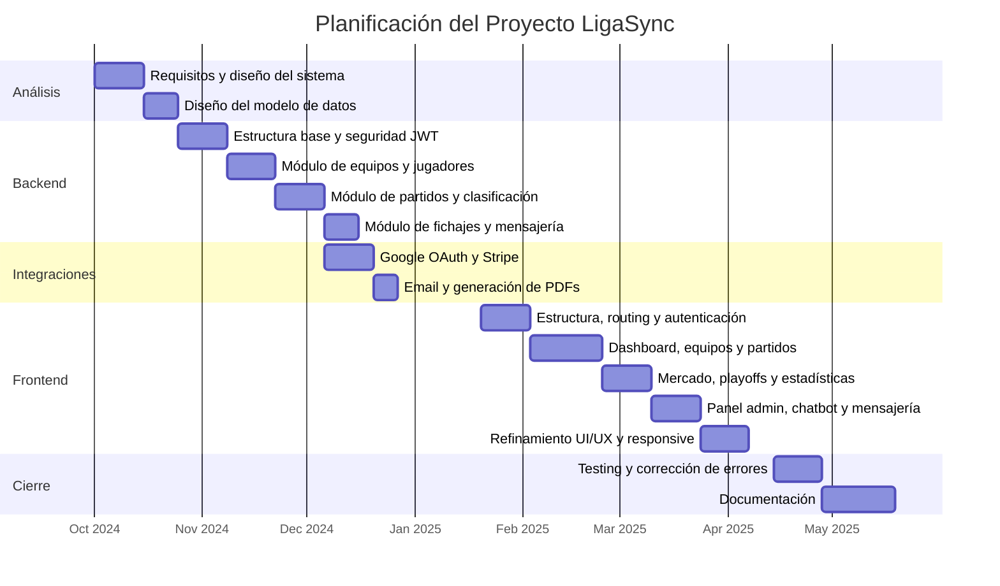
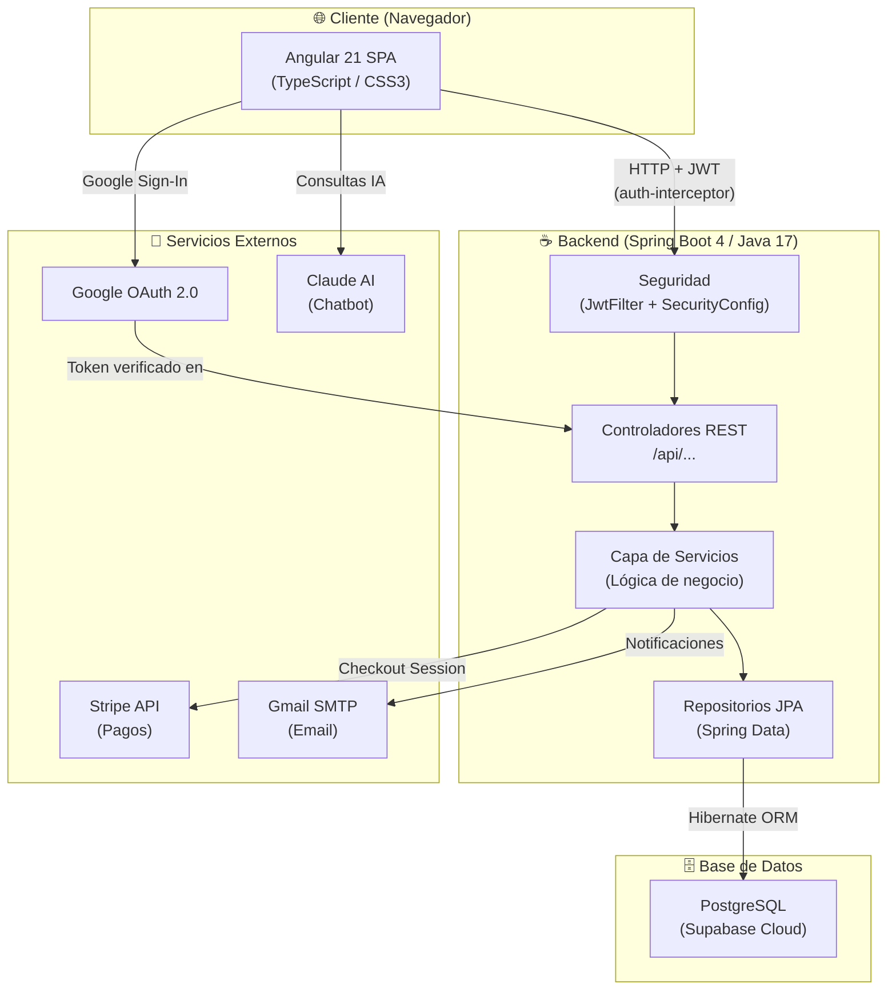
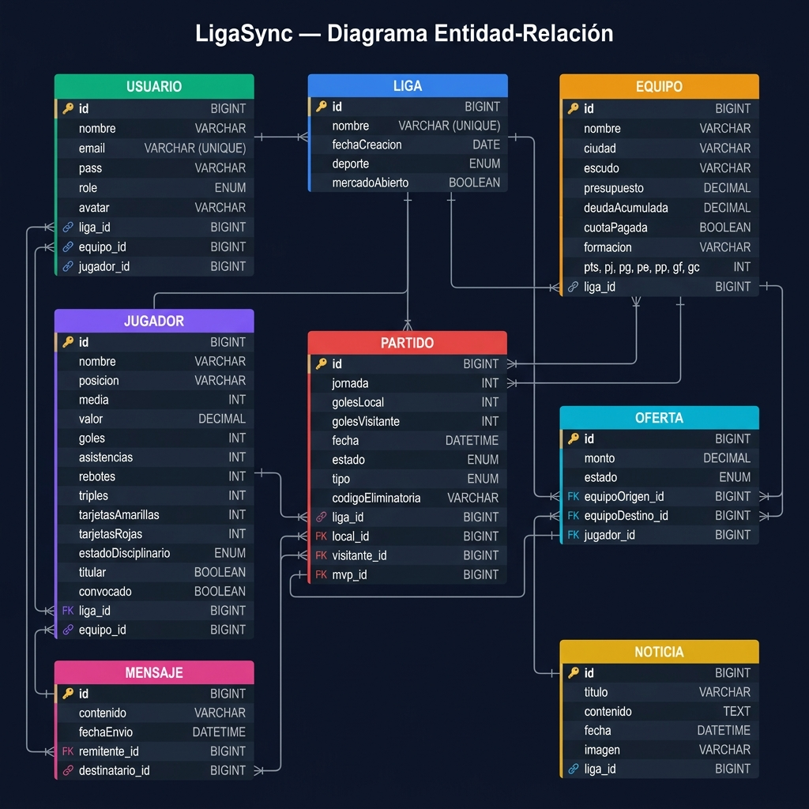
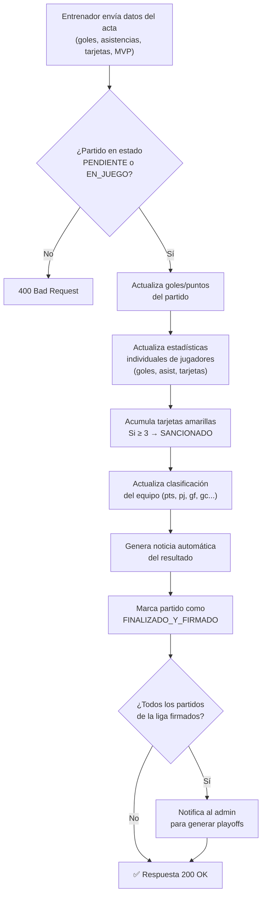
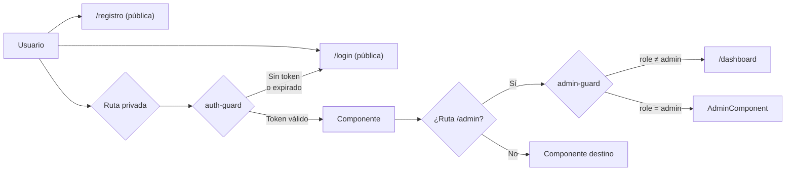
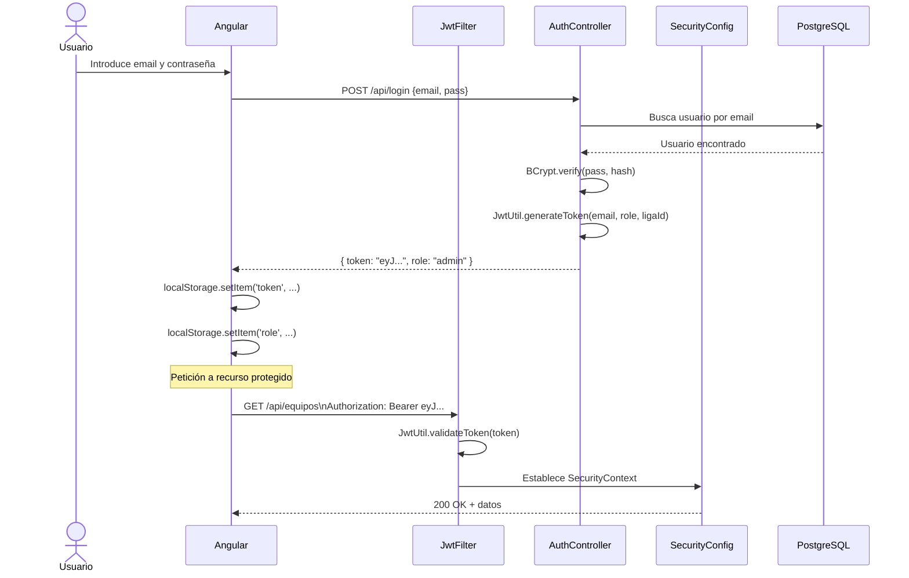
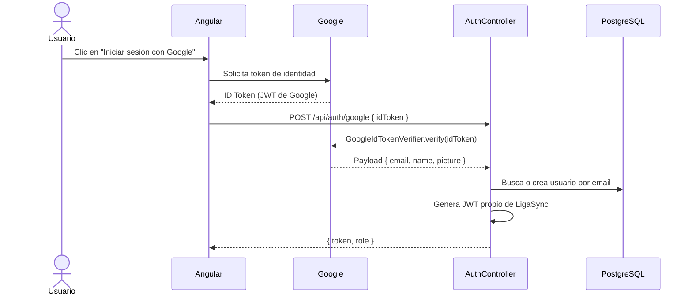
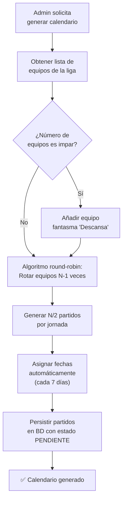
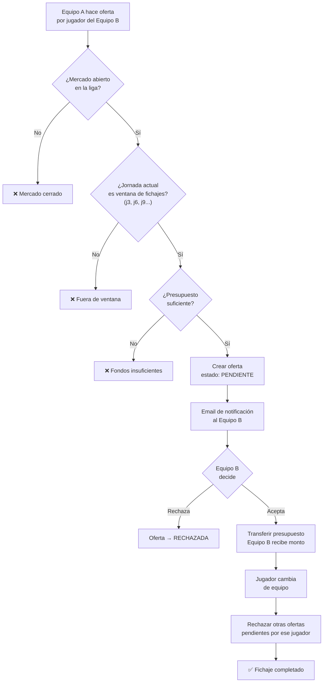
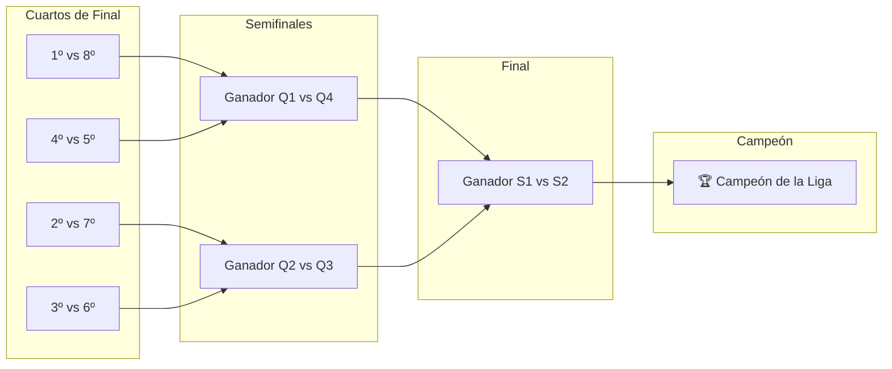

<div align="center">

---

<br><br><br><br>

# LIGASYNC
## Plataforma de Gestión de Ligas Deportivas

<br><br>

---

### PROYECTO FINAL DE CICLO

**Ciclo Formativo de Grado Superior**
**Desarrollo de Aplicaciones Web (DAW)**

---

<br><br>

| | |
|:--|:--|
| **Alumno/a** | Ignacio García Tello |
| **Centro Educativo** | IES Ágora |
| **Tutor/a** | [NOMBRE DEL TUTOR/A] |
| **Ciclo Formativo** | Desarrollo de Aplicaciones Web (DAW) |
| **Curso** | 2024 / 2025 |

<br><br><br>

---

*"Una plataforma diseñada para que cualquier grupo de amigos pueda gestionar su propia liga, desde el primer partido hasta el campeón."*

---

</div>

<br><br><br><br><br><br><br><br>

---

<!-- ============================================================ -->
<!--                        ÍNDICE                               -->
<!-- ============================================================ -->

# Índice

1. [Introducción](#1-introducción)
   - 1.1. [Descripción del Proyecto](#11-descripción-del-proyecto)
   - 1.2. [Justificación y Motivación](#12-justificación-y-motivación)
   - 1.3. [Áreas de Trabajo](#13-áreas-de-trabajo)
   - 1.4. [Objetivos](#14-objetivos)

2. [Desarrollo del Proyecto](#2-desarrollo-del-proyecto)
   - 2.1. [Planificación Temporal (Diagrama de Gantt)](#21-planificación-temporal-diagrama-de-gantt)
   - 2.2. [Arquitectura del Sistema](#22-arquitectura-del-sistema)
   - 2.3. [Stack Tecnológico](#23-stack-tecnológico)
   - 2.4. [Base de Datos](#24-base-de-datos)
   - 2.5. [Backend – Spring Boot](#25-backend--spring-boot)
   - 2.6. [Frontend – Angular](#26-frontend--angular)
   - 2.7. [Seguridad y Autenticación](#27-seguridad-y-autenticación)
   - 2.8. [Funcionalidades Principales](#28-funcionalidades-principales)
   - 2.9. [Integraciones Externas](#29-integraciones-externas)

3. [Dificultades Encontradas y Posibles Soluciones](#3-dificultades-encontradas-y-posibles-soluciones)

4. [Posibles Mejoras](#4-posibles-mejoras)

5. [Resultados](#5-resultados)

6. [Conclusión](#6-conclusión)

7. [Anexos](#7-anexos)
   - 7.1. [Manual Técnico – Instalación y Despliegue](#71-manual-técnico--instalación-y-despliegue)
   - 7.2. [Manual de Usuario](#72-manual-de-usuario)
   - 7.3. [Diagrama Entidad-Relación](#73-diagrama-entidad-relación)
   - 7.4. [Diagrama de Flujo – Flujos Principales](#74-diagrama-de-flujo--flujos-principales)

---

<!-- ============================================================ -->
<!--                    1. INTRODUCCIÓN                          -->
<!-- ============================================================ -->

# 1. Introducción

## 1.1. Descripción del Proyecto

LigaSync es una aplicación web full-stack orientada a la gestión completa de ligas deportivas amateur. La plataforma permite a un grupo de usuarios crear su propia liga privada, gestionar equipos y jugadores, registrar resultados de partidos, llevar la clasificación en tiempo real, disputar una fase de playoffs y comunicarse entre sí a través de un sistema de mensajería integrado.

El proyecto nace con la vocación de cubrir un nicho muy concreto: las ligas entre amigos o grupos locales que, hasta ahora, se gestionaban mediante hojas de cálculo compartidas, grupos de WhatsApp o plataformas genéricas que no se adaptaban a sus necesidades específicas. LigaSync centraliza todo ese caos en una única aplicación moderna, accesible desde cualquier navegador y con una experiencia de usuario cuidada.

La aplicación admite dos modalidades deportivas —**fútbol** y **baloncesto**— con estadísticas propias de cada deporte (goles y asistencias para fútbol; puntos, rebotes y triples para baloncesto). Además, incorpora funcionalidades avanzadas como un **mercado de fichajes** con ventanas de transferencias, un **sistema de pagos** de cuotas mediante Stripe, generación automática de **actas en PDF**, notificaciones por **correo electrónico** y un **chatbot** de asistencia basado en inteligencia artificial.

La arquitectura del sistema sigue el patrón **cliente-servidor**: un backend REST desarrollado con **Spring Boot** (Java) expone una API consumida por un frontend **Angular** (TypeScript). La base de datos es **PostgreSQL**, alojada en **Supabase**, y la autenticación se gestiona mediante **JSON Web Tokens (JWT)**, con soporte adicional para inicio de sesión con **Google OAuth 2.0**.

---

## 1.2. Justificación y Motivación

La idea de desarrollar LigaSync surgió de una experiencia personal directa. Desde hace varios años participo en una liga de fútbol sala con amigos, y la gestión de dicha liga siempre ha sido un problema recurrente: resultados anotados en papel, clasificaciones calculadas a mano, discusiones sobre si un goleador había marcado dos o tres goles, traspasos de jugadores acordados por mensajes privados... Toda esa fricción restaba disfrute a la competición.

Al enfrentarme a la elección del proyecto final de ciclo, la solución fue inmediata: desarrollar la herramienta que yo mismo hubiera querido tener. Esto garantizaba que el análisis de requisitos partiría de necesidades reales y concretas, y que el resultado final tendría utilidad práctica más allá del ámbito académico.

Desde el punto de vista formativo, el proyecto representa una oportunidad de integrar y consolidar los conocimientos adquiridos a lo largo del ciclo: programación orientada a objetos con Java, desarrollo frontend con frameworks modernos, diseño de bases de datos relacionales, seguridad en aplicaciones web, consumo de APIs de terceros y despliegue en entornos cloud. LigaSync actúa, en definitiva, como un banco de pruebas real donde cada decisión técnica tiene consecuencias tangibles.

Finalmente, existía también una motivación de aprendizaje autónomo: el proyecto me obligó a investigar tecnologías que no formaban parte del currículo oficial del ciclo, como la integración con Stripe para pagos, la generación dinámica de PDFs con iText, el protocolo OAuth 2.0 de Google o la implementación de un chatbot basado en IA, lo que enriqueció notablemente la experiencia de desarrollo.

---

## 1.3. Áreas de Trabajo

El desarrollo de LigaSync abarca las siguientes áreas técnicas y funcionales:

| Área | Descripción |
|:-----|:------------|
| **Desarrollo Backend** | Diseño e implementación de una API REST con Spring Boot, incluyendo controladores, servicios, repositorios y entidades JPA. |
| **Desarrollo Frontend** | Construcción de una SPA (Single Page Application) con Angular 21, empleando componentes standalone, servicios reactivos y enrutamiento con guards de seguridad. |
| **Diseño de Base de Datos** | Modelado del esquema relacional en PostgreSQL, con gestión de relaciones entre entidades y configuración del entorno en Supabase. |
| **Seguridad Web** | Implementación de autenticación y autorización mediante JWT, filtros de seguridad HTTP con Spring Security, cifrado de contraseñas con BCrypt y OAuth 2.0 con Google. |
| **Integración de Servicios Externos** | Conexión con APIs de terceros: Stripe (pagos), Google (autenticación), JavaMail (notificaciones por email) e iText (generación de PDFs). |
| **Diseño UI/UX** | Diseño visual de la interfaz con CSS puro, variables de diseño, animaciones y una estética "Editorial Deportivo Moderno" sin dependencia de frameworks CSS. |
| **Lógica de Negocio** | Implementación de reglas de negocio complejas: cálculo de clasificaciones, generación automática de calendarios (round-robin), sistema de playoffs y mecánica de fichajes. |
| **Internacionalización (i18n)** | Soporte multiidioma (español/inglés) mediante la librería `@ngx-translate`. |

---

## 1.4. Objetivos

### Objetivos Generales

- Desarrollar una aplicación web completa y funcional que resuelva un problema real de gestión deportiva amateur.
- Aplicar de forma integrada los conocimientos del ciclo formativo DAW en un proyecto de complejidad profesional.
- Adquirir competencias en tecnologías modernas de desarrollo full-stack más allá del currículo oficial.

### Objetivos Específicos

**Backend:**
- Diseñar e implementar una API REST con Spring Boot siguiendo las convenciones REST y devolviendo códigos HTTP semánticamente correctos.
- Modelar una base de datos relacional capaz de representar todas las entidades del dominio deportivo.
- Garantizar la seguridad de todos los endpoints mediante autenticación JWT y autorización por roles.
- Integrar servicios de terceros: pasarela de pago Stripe, servidor de correo SMTP y autenticación Google OAuth 2.0.

**Frontend:**
- Construir una SPA con Angular 21 con navegación fluida entre secciones, carga dinámica de datos y gestión de estado mínima en `localStorage`.
- Implementar una UI visualmente atractiva y responsiva, sin dependencia de librerías de componentes, usando únicamente CSS3 con variables y animaciones nativas.
- Proteger las rutas de la aplicación mediante guards de autenticación y autorización por rol.

**Funcionales:**
- Permitir la creación y gestión de ligas independientes con múltiples equipos y jugadores.
- Automatizar la generación de calendarios de competición y la fase de playoffs.
- Implementar un sistema de fichajes con control de ventanas de transferencia y validación de presupuesto.
- Ofrecer estadísticas individuales y colectivas actualizadas en tiempo real tras cada partido.

---

<!-- ============================================================ -->
<!--                2. DESARROLLO DEL PROYECTO                   -->
<!-- ============================================================ -->

# 2. Desarrollo del Proyecto

## 2.1. Planificación Temporal (Diagrama de Gantt)

El desarrollo de LigaSync se organizó en diez fases distribuidas a lo largo de aproximadamente siete meses, desde octubre de 2024 hasta mayo de 2025. La metodología seguida fue incremental: cada fase entregaba un bloque funcional sobre el que se construía el siguiente, lo que permitió detectar y corregir errores de diseño de forma temprana.



### Resumen de Fases

| Fase | Descripción | Duración |
|:-----|:------------|:--------:|
| Análisis | Definición de requisitos, arquitectura y modelo de datos | 3 semanas |
| Backend – Base | Estructura Maven, Spring Security, JWT, entidades JPA | 2 semanas |
| Backend – Core | Controladores REST, lógica de partidos y clasificación | 4 semanas |
| Backend – Avanzado | Fichajes, mensajería, playoffs, noticias | 2 semanas |
| Integraciones | Google OAuth, Stripe, JavaMail, iText (PDF) | 3 semanas |
| Frontend – Base | Routing, guards, interceptor, login/registro | 2 semanas |
| Frontend – Core | Dashboard, equipos, partidos, clasificación | 3 semanas |
| Frontend – Avanzado | Mercado, playoffs, estadísticas, admin, chatbot | 4 semanas |
| Testing | Pruebas funcionales, corrección de bugs, ajustes | 2 semanas |
| Documentación | Redacción de la memoria y manuales | 3 semanas |

---

## 2.2. Arquitectura del Sistema

LigaSync sigue una arquitectura de **tres capas** desacopladas: presentación (Angular), lógica de negocio (Spring Boot) y persistencia (PostgreSQL). La comunicación entre capas se realiza exclusivamente a través de HTTP/REST con payloads JSON. El frontend nunca accede directamente a la base de datos.



### Patrones y Decisiones Arquitectónicas

| Decisión | Alternativas consideradas | Motivo de la elección |
|:---------|:--------------------------|:----------------------|
| API REST con Spring Boot | Django, Node.js/Express | Tipado fuerte, ecosistema maduro, integración natural con Spring Security |
| Angular 21 (standalone) | React, Vue | Currículo del ciclo, componentes standalone eliminan NgModules innecesarios |
| JWT para autenticación | Sesiones en servidor, cookies | Arquitectura stateless, compatible con SPA y despliegue separado frontend/backend |
| PostgreSQL en Supabase | MySQL local, H2 | Base de datos relacional robusta en cloud gratuito, sin gestión de servidor |
| CSS puro sin frameworks | Bootstrap, Tailwind | Control total del diseño, sin dependencias externas, rendimiento óptimo |

---

## 2.3. Stack Tecnológico

### Backend

| Tecnología | Versión | Uso |
|:-----------|:-------:|:----|
| Java | 17 | Lenguaje principal del backend |
| Spring Boot | 4.0.5 | Framework principal REST |
| Spring Security | 4.x | Autenticación y autorización |
| Spring Data JPA | 4.x | Capa de persistencia con Hibernate |
| PostgreSQL | 15 | Base de datos relacional |
| JJWT (jjwt-api) | 0.12.x | Generación y validación de JWT |
| Lombok | 1.18.x | Reducción de boilerplate (getters, constructores) |
| iText Core | 9.x | Generación de actas en PDF |
| Google API Client | 2.x | Verificación de tokens Google OAuth |
| Stripe Java | 28.x | Integración de pagos |
| JavaMail | 3.x | Envío de correos electrónicos |
| Maven | 3.9 | Gestión de dependencias y build |

### Frontend

| Tecnología | Versión | Uso |
|:-----------|:-------:|:----|
| Angular | 21.2 | Framework SPA principal |
| TypeScript | 5.9 | Lenguaje tipado para Angular |
| RxJS | 7.8 | Programación reactiva y observables |
| @ngx-translate | 17 | Internacionalización (i18n) español/inglés |
| Chart.js | 4.5 | Gráficos de estadísticas |
| CSS3 puro | — | Estilos sin dependencia de frameworks |
| Angular CLI | 21.x | Herramienta de scaffolding y build |
| npm | 11.6 | Gestor de paquetes |

---

## 2.4. Base de Datos

### Diagrama Entidad-Relación



### Descripción de Entidades

| Entidad | Registros principales | Notas |
|:--------|:----------------------|:------|
| **Liga** | Identificador de la liga; campo `nombre` único en toda la BD | Aísla completamente los datos: equipos, jugadores y partidos de una liga no son visibles desde otra |
| **Usuario** | Email único; rol enum: `admin`, `entrenador`, `jugador`, `espectador` | La relación con `equipo_id` y `jugador_id` es opcional, dependiendo del rol asignado |
| **Equipo** | Estadísticas de clasificación desnormalizadas (pts, pj, pg...) | Se actualizan tras firmar cada acta para evitar recálculo costoso en cada consulta |
| **Jugador** | Campo `valor` calculado mediante fórmula exponencial basada en media | `estadoDisciplinario` controla si puede jugar (sancionado por acumulación de amarillas) |
| **Partido** | `estado` enum: `PENDIENTE`, `EN_JUEGO`, `FINALIZADO_Y_FIRMADO` | Tipo `REGULAR` o eliminatoria (`CUARTOS`, `SEMIFINAL`, `FINAL`). El campo `codigoEliminatoria` agrupa las dos partes de un cruce |
| **Oferta** | `estado` enum: `PENDIENTE`, `ACEPTADA`, `RECHAZADA` | Al aceptar una oferta, el sistema rechaza automáticamente todas las demás sobre el mismo jugador |
| **Mensaje** | Contenido hasta 2000 caracteres | Chat privado punto a punto entre usuarios de la misma liga |
| **Noticia** | Generadas automáticamente por el sistema tras firmar un partido | También pueden crearse manualmente por el administrador |

---

## 2.5. Backend – Spring Boot

### Estructura de Paquetes

```
ligasync-backend/src/main/java/LigaSync/API/
├── controller/
│   ├── AuthController.java        # Login, registro, Google OAuth
│   ├── EquipoController.java      # CRUD equipos, presupuesto
│   ├── JugadorController.java     # CRUD jugadores, formación
│   ├── PartidoController.java     # Partidos, calendario, playoffs
│   ├── LigaController.java        # Estado de liga y mercado
│   ├── UsuarioController.java     # Gestión de usuarios
│   ├── OfertaController.java      # Mercado de fichajes
│   ├── MensajeController.java     # Sistema de chat
│   ├── NoticiaController.java     # Noticias de la liga
│   └── PagoController.java        # Integración Stripe
├── model/
│   ├── Usuario.java               # @Entity con BCrypt pass
│   ├── Liga.java
│   ├── Equipo.java
│   ├── Jugador.java
│   ├── Partido.java
│   ├── Oferta.java
│   ├── Mensaje.java
│   └── Noticia.java
├── repository/                    # Interfaces JpaRepository
├── service/
│   ├── AuthService.java           # Lógica de registro y Google OAuth
│   ├── EmailService.java          # Envío de correos
│   ├── PdfService.java            # Generación de actas PDF
│   └── StripeService.java         # Sesiones de pago
├── dto/                           # Request/Response DTOs
└── security/
    ├── SecurityConfig.java        # CORS, rutas públicas/privadas
    ├── JwtUtil.java               # Generación y validación JWT
    ├── JwtFilter.java             # Filtro HTTP por request
    └── SecurityUtils.java         # Extrae ligaId/userId del token
```

### Endpoints de la API REST

#### AuthController – `/api`

| Método | Endpoint | Descripción | Acceso |
|:------:|:---------|:------------|:------:|
| `POST` | `/login` | Autenticación email/password. Devuelve `{ token, role }` | Público |
| `POST` | `/auth/registro` | Crea usuario y, opcionalmente, una nueva liga | Público |
| `POST` | `/auth/google` | Verifica token Google y autentica/registra al usuario | Público |
| `POST` | `/auth/asignar-liga` | Asigna un usuario existente a una liga por nombre | Público |

#### EquipoController – `/api/equipos`

| Método | Endpoint | Descripción |
|:------:|:---------|:------------|
| `GET` | `/` | Equipos de la liga del usuario autenticado |
| `GET` | `/{id}` | Detalle de un equipo |
| `POST` | `/` | Crear equipo (solo admin) |
| `PUT` | `/{id}` | Actualizar datos del equipo |
| `PUT` | `/{id}/pagar-deuda` | Pagar deuda acumulada del equipo |
| `PATCH` | `/{id}/presupuesto` | Ajustar presupuesto manualmente |
| `DELETE` | `/{id}` | Eliminar equipo (solo admin) |

#### PartidoController – `/api/partidos`

| Método | Endpoint | Descripción |
|:------:|:---------|:------------|
| `GET` | `/` | Todos los partidos de la liga |
| `GET` | `/jornada/{num}` | Partidos de una jornada concreta |
| `GET` | `/jornada-actual` | Jornada en curso |
| `POST` | `/generar-calendario` | Genera el calendario round-robin completo |
| `PUT` | `/{id}/resultado` | Actualiza resultado provisional |
| `PUT` | `/{id}/firmar` | Firma el acta: consolida estadísticas y clasificación |
| `POST` | `/generar-playoffs` | Genera cuadro de playoffs con los 8 primeros |
| `GET` | `/{id}/acta-pdf` | Descarga el acta del partido en PDF |
| `DELETE` | `/{id}` | Elimina un partido (solo admin) |

### Flujo de Firma de Acta (Lógica de Negocio Central)



---

## 2.6. Frontend – Angular

### Estructura de Componentes

```
ligasync-web/src/app/
├── login/              # Formulario de acceso (email + Google)
├── registro/           # Crear liga o unirse a una existente
├── dashboard/          # Página de inicio: noticias, resumen
├── equipos/            # CRUD de equipos
├── partidos/           # Calendario y registro de resultados
├── clasificacion/      # Tabla de posiciones
├── estadisticas/       # Top goleadores, asistentes, MVP
├── mercado/            # Ofertas de fichaje entre equipos
├── mensajes/           # Chat privado entre usuarios
├── mi-equipo/          # Gestión de plantilla y formación
├── mi-perfil/          # Datos del usuario autenticado
├── playoffs/           # Cuadro eliminatorio visual
├── admin/              # Panel de administración
├── chatbot/            # Asistente IA integrado
├── pago-exito/         # Confirmación de pago Stripe
├── pago-cancelado/     # Cancelación de pago Stripe
├── shared/             # Componentes reutilizables (navbar, etc.)
├── app.routes.ts       # Definición de rutas con guards
├── auth.service.ts     # Servicio de autenticación
├── auth-guard.ts       # Guard: requiere login
├── admin-guard.ts      # Guard: requiere rol admin
└── auth-interceptor.ts # Añade JWT a cada petición HTTP
```

### Sistema de Rutas y Guards



### Interceptor HTTP (auth-interceptor.ts)

Todas las peticiones salientes pasan por el interceptor, que añade automáticamente la cabecera de autorización. Ningún componente gestiona tokens manualmente.

```
Petición HTTP saliente
        │
        ▼
┌─────────────────────────────┐
│      AuthInterceptor        │
│                             │
│  token = localStorage       │
│         .getItem('token')   │
│                             │
│  Si token existe:           │
│  headers.Authorization =    │
│  'Bearer ' + token          │
└─────────────────────────────┘
        │
        ▼
  Petición con JWT → API
```

### Convenciones de Desarrollo Frontend

- **Componentes standalone**: todos usan `standalone: true`, sin `app.module.ts`.
- **Inyección con `inject()`**: `private http = inject(HttpClient)` en lugar de inyección en constructor.
- **Observables**: todos los `.subscribe()` incluyen bloque `error` con `console.error` descriptivo.
- **Internacionalización**: textos de la UI se cargan desde ficheros `assets/i18n/es.json` y `en.json` mediante `TranslateService`.

---

## 2.7. Seguridad y Autenticación

### Flujo de Autenticación JWT



### Flujo de Autenticación con Google OAuth



### Roles y Permisos

| Rol | Descripción | Permisos principales |
|:----|:------------|:---------------------|
| `admin` | Administrador de la liga | Todo: CRUD completo, generar calendario, gestionar usuarios, playoffs |
| `entrenador` | Gestor de un equipo | Gestionar su plantilla, firmar actas, hacer ofertas, mensajería |
| `jugador` | Jugador vinculado a un equipo | Ver información, mensajería, su perfil |
| `espectador` | Usuario sin equipo asignado | Solo lectura: clasificación, estadísticas, partidos |

---

## 2.8. Funcionalidades Principales

### Generación Automática de Calendario

El sistema implementa el algoritmo **round-robin** para generar el calendario de liga. Dado `n` equipos, produce `n-1` jornadas (si `n` es par) con `n/2` partidos por jornada. Si `n` es impar, se añade un equipo "fantasma" (descanso).



### Sistema de Fichajes (Mercado de Transferencias)



### Fase de Playoffs



---

## 2.9. Integraciones Externas

### Stripe – Sistema de Pagos

Se integra la pasarela de pago **Stripe Checkout** para gestionar el cobro de cuotas de participación por equipo. El flujo es:

1. El admin abre la sesión de pago → Spring Boot crea una `Session` en Stripe con precio y URLs de retorno.
2. El usuario es redirigido a la página de pago de Stripe (segura, alojada por Stripe).
3. Stripe redirige a `/pago-exito` o `/pago-cancelado` en función del resultado.
4. El backend marca la cuota del equipo como pagada (`cuotaPagada = true`).

### Google OAuth 2.0

La autenticación con Google utiliza la librería `google-api-client`. El frontend obtiene un **ID Token** de Google mediante el botón estándar de Google Sign-In, lo envía al backend, y este lo verifica con `GoogleIdTokenVerifier` para garantizar su autenticidad sin necesidad de almacenar credenciales de Google en el servidor.

### JavaMail – Notificaciones por Email

El servicio `EmailService` utiliza Spring Mail con servidor SMTP de Gmail para enviar:
- **Email de bienvenida** al registrarse en la plataforma.
- **Notificación de oferta recibida** cuando un equipo lanza una oferta de fichaje.
- **Confirmación de fichaje** al aceptar o rechazar una oferta.

### iText – Generación de Actas en PDF

Tras firmar un partido, el sistema puede generar un **acta oficial en PDF** con el servicio `PdfService` (basado en iText Core 9). El documento incluye: nombre del partido, fecha, resultado, relación de goleadores, tarjetas, MVP y firma digital de los equipos.

---
